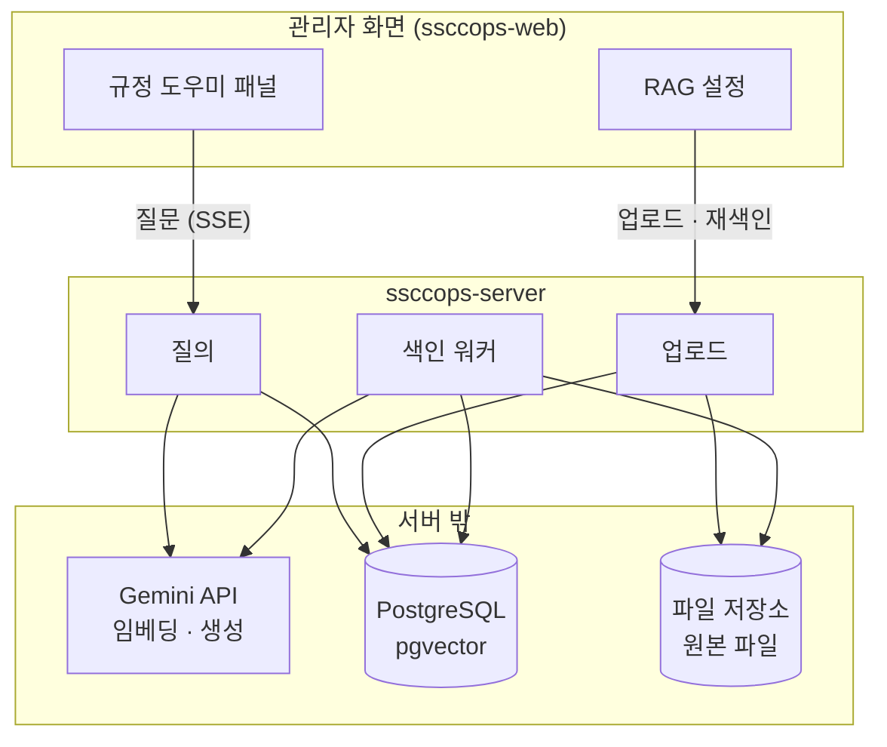
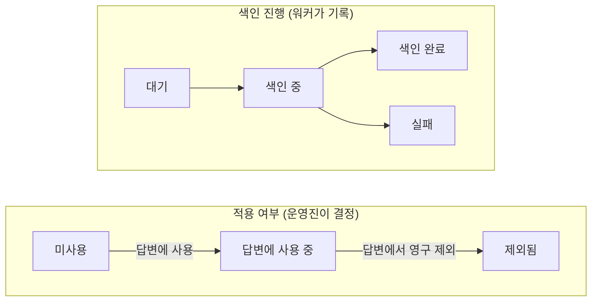
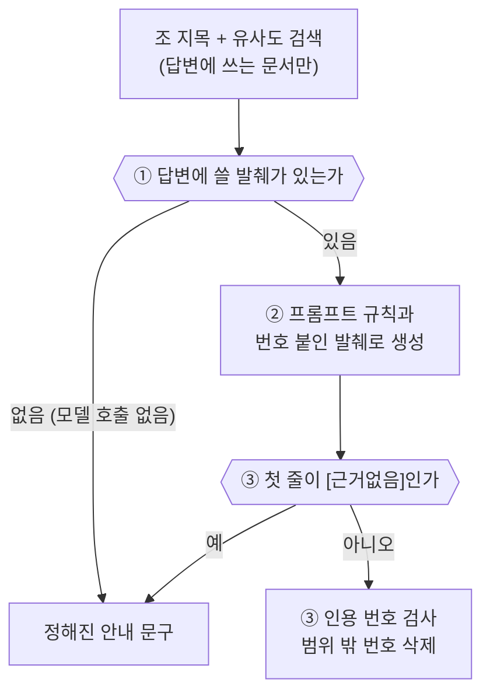

SSCCOps 관리자 화면에 회칙을 찾아 답하는 규정 도우미를 붙였습니다. 정회원 승격 심사를 앞두고 조건을 다시 보거나 총회 안건이 의결 정족수를 채웠는지 따질 때마다, 마크다운과 PDF로 흩어진 회칙과 세칙을 오가며 조항을 찾던 일을 줄이고 싶었습니다. 답변에는 근거가 된 조항의 원문을 함께 보여 줍니다.

만들면서 가장 오래 붙들고 있던 건 검색과 인용이었습니다. "회칙 제3조"를 물었는데 부칙 제4조가 1위로 나왔고, 제3조를 찾도록 고친 뒤에도 "그 다음 조는?"에는 답하지 못했습니다. 근거를 찾지 못했다는 답에 인용 카드가 다섯 장 붙은 적도 있습니다. 이 글에서는 ssccops-server에서 회칙을 어떻게 나누고, 검색과 인용을 어떻게 고쳤는지 적습니다.

<!-- truncate -->

## 이런 걸 만들었습니다


*ssccops-web의 패널 코드를 그대로 옮겨 그린 화면입니다. 문서 이름과 날짜는 예시입니다.*

오른쪽 아래 버튼을 눌러 질문하면 서너 문장으로 답이 옵니다. 답변 위의 배지는 어느 문서를 근거로 읽었는지 알려 주고, 본문의 `[제7조]`는 그 문장이 어디서 나왔는지 가리킵니다. "답변 근거 보기"를 펼치면 같은 표시가 붙은 카드에 조 제목과 원문이 나옵니다.

회원 자격에 관한 답변은 회칙 원문과 바로 대조할 수 있어야 했습니다. 답변을 만드는 것만큼 출처를 보여 주는 데 신경을 쓴 이유입니다.

## 새 서버를 두지 않았습니다

벡터 DB나 Redis처럼 따로 운영해야 하는 것은 늘리지 않기로 처음부터 정했습니다. 동아리 서비스라 운영할 사람이 많지 않고, 규정 문서도 몇 건 되지 않습니다. 필요한 것은 이미 쓰던 것으로 채웠습니다.

| 필요한 것 | 쓴 것 |
|---|---|
| 벡터 검색 | 쓰던 PostgreSQL에 pgvector 확장 |
| 원본 파일 | 쓰던 파일 저장소(Cloudflare R2) |
| 임베딩과 답 생성 | Gemini API |
| 색인 작업 큐 | 문서 테이블의 상태 컬럼 하나. 워커는 같은 프로세스 안에서 돕니다 |
| 대화 기록, 질문 한도 | 애플리케이션 힙의 Caffeine 캐시 |



벡터 인덱스(HNSW)도 만들지 않았습니다. 회칙 개정안 하나가 청크 40개라 인덱스 없이 순차 스캔으로 두고, 대신 적재할 수 있는 청크를 3,000개(임베딩으로 약 14MB)로 묶었습니다.

임베딩 모델은 키를 넣고 두 후보를 직접 불러 비교했습니다. 고르는 데 영향을 준 차이만 적었습니다.

| | gemini-embedding-001 | gemini-embedding-2 |
|---|---|---|
| 입력 상한 | 2,048 토큰 | 8,192 토큰 |
| 768차원으로 받은 벡터 | 정규화되지 않음 (노름 0.5819) | 정규화됨 (노름 1.0) |
| 문서용, 질문용 task type | 결과가 달라집니다 | 결과가 같습니다 |

2를 골랐습니다. 긴 조문도 입력 상한에 걸리지 않고, 정규화를 따로 할 필요가 없었습니다. Spring AI 1.1.8의 Gemini 임베딩 모델은 task type을 요청에 싣지 않는데, 2는 task type과 상관없이 결과가 같아서 이 문제도 비켜 갔습니다.

## 문서는 레포가 아니라 화면에서 올립니다

처음 계획은 회칙을 마크다운으로 레포에 커밋하고 Gradle 태스크로 적재하는 것이었습니다. 그런데 회칙 개정은 총회에서 나옵니다. 커밋으로 관리하면 개정을 반영할 수 있는 사람이 서버를 배포할 수 있는 사람뿐입니다. 참조해야 할 문서의 절반은 저희가 쓴 것도 아니어서, 학교 지침이나 세칙은 PDF와 DOCX로 옵니다. 결국 관리자 화면에 "RAG 설정"을 두고, 권한이 있는 운영진이 직접 문서를 올리도록 했습니다.


*이것도 웹 코드로 그린 화면입니다. 목록의 문서는 예시이고, 본문 폭에 맞추려고 표의 크기와 등록일 열은 뺐습니다.*

처음에는 문서 상태를 컬럼 하나로 두려 했습니다. 그런데 처음 올릴 문서가 회칙 개정안이었고, 그 부칙은 발효일을 개강총회 의결일로 비워 두고 있었습니다. 색인이 끝나도 아직 답변에 쓰면 안 되는 문서입니다. 목록에 "상태"와 "적용"이 따로 있는 건 이 때문입니다.



재색인은 문서를 다시 "대기"로 돌려 색인을 새로 하는 조작이고, "답변에 사용"은 색인이 끝난 문서에만 누를 수 있습니다. 질문에 쓰이는 문서는 "색인 완료"이면서 "답변에 사용 중"인 것뿐이고, 이 조건은 벡터 검색 필터에 바로 겁니다.

업로드 요청에서는 파싱과 원본 보관까지만 하고, 시간이 오래 걸리는 임베딩은 같은 서버의 색인 워커가 뒤에서 처리합니다. 파싱을 요청 안에서 하기 때문에, 스캔본처럼 글자를 뽑을 수 없는 파일은 올리는 순간 거절됩니다. 색인이 실패해도 자동으로 다시 시도하지는 않습니다. 실패 원인 대부분이 무료 쿼터 소진이라, 재시도하면 쿼터만 더 빨리 쓰게 됩니다. 실패 사유는 목록에 남고, 운영진이 확인한 뒤 재색인을 누릅니다.

## 회칙은 조 단위로 자릅니다

RAG 예제를 따라 하면 보통 문서를 일정한 길이로 자릅니다. 회칙에 그대로 적용하면 청크가 조 경계를 넘습니다.


오른쪽은 같은 조문을 평문 경로(600자, 앞 청크 끝 100자 겹침)에 넣어 실제로 잘라 본 결과입니다. 두 번째 청크는 제7조 머리에서 시작해 7항 1호에서 끝나고, 세 번째 청크는 7항 문장 한가운데("다음 각 호의 어느" 바로 뒤)에서 시작해 제8조 9항까지 이어집니다. 이 청크가 검색에 걸리면 답변은 제7조를 근거로 들면서 제8조의 문장을 보여 줄 수 있습니다.

회칙은 조 경계를 기준으로 청크를 만들고, 긴 조만 항 경계에서 나누기로 했습니다. 회칙 마크다운 파일에는 다음과 같은 형식을 정해 두었습니다.

```markdown
## 제2장 회원

### 제7조 (회원의 구분) ⟨개정⟩

회원의 구분은 아래와 같이 한다.

- **1항** 본 회의 회원은 등급과 학적으로 구분한다. …
- **5항** 활동회원은 준회원의 자격을 갖춘 자 중 …
    - **1호** 스터디 또는 트랙의 스터디장·트랙장을 맡아 …

> 해설 문단. 조문이 아니라 개정 이유를 적은 글입니다.
```

장, 조, 항만 가려내면 충분해서 파서는 마크다운 AST 없이 줄 단위로 짰습니다. 그런데 실제 개정안을 넣자 조번호를 `int` 하나로 둔 것부터 문제가 됐습니다. "제27조의2" 같은 가지 조번호가 있었고, 숫자 하나로 받으면 파싱이 실패하거나 제27조와 한 조로 합쳐집니다. 지금은 (27, 2) 두 값으로 다루고 표기는 원문 그대로 둡니다. 부칙에서는 조번호가 제1조부터 다시 시작해서 본칙 제3조와 부칙 제3조가 둘 다 있었습니다. 인용 키에 부칙 여부를 넣어 "부칙 제3조"로 구분했습니다.

조문보다 긴 해설도 있었습니다. 제7조는 조문이 22줄인데 해설이 8문단입니다. 해설까지 넣으면 검색이 해설에 걸리고, 인용 카드에 조문 대신 해설이 나옵니다. 해설은 색인에서 빼고 원본 파일에만 남겼습니다. `⟨개정⟩`, `⟨신설⟩` 같은 개정 표시는 임베딩할 텍스트에서 지우고 메타데이터로 옮겼습니다.

임베딩할 텍스트 맨 앞에는 장 제목을 붙입니다(`제2장 회원 · 제7조 (회원의 구분)`). "제28조 (설치)"만으로는 무엇을 설치하는지 알 수 없고, 이 조는 개정안에서 다른 장으로 옮겨 갔기 때문입니다. 긴 조를 항 경계에서 나눌 때는 나눈 묶음마다 이 머리를 다시 붙입니다. 목표 길이 450자는 개정안 전문으로 여러 번 재 보고 정했습니다. 이 값이면 조 36개가 청크 40개가 되고, 나뉘는 조는 제7, 8, 16, 17조 네 개입니다.

나누는 코드는 짧습니다. 머리까지 합쳐 목표 길이 안에 들어오면 조 전체를 청크 하나로 두고, 넘을 때만 항을 하나씩 쌓다가 넘치기 직전에 끊습니다(`RegulationChunker`).

```java
static final int TARGET_CHUNK_CHARS = 450;

private static List<String> bodies(
        RegulationChapter chapter, RegulationArticle article) {
    List<String> blocks = new ArrayList<>();
    if (!article.preamble().isEmpty()) {
        blocks.add(String.join("\n", article.preamble()));
    }
    for (RegulationClause clause : article.clauses()) {
        blocks.add(clause.text());
    }

    int headerLength = heading(chapter, article).length() + 1;
    String whole = String.join("\n", blocks);
    // 항이 없거나 머리까지 450자 이내: 조 하나 = 청크 하나
    if (article.clauses().isEmpty()
            || headerLength + whole.length() <= TARGET_CHUNK_CHARS) {
        return List.of(whole);
    }

    // 긴 조만 항 경계에서 나눔 (항 하나가 450자를 넘어도 자르지 않음)
    List<String> bodies = new ArrayList<>();
    StringBuilder current = new StringBuilder();
    for (String block : blocks) {
        if (!current.isEmpty()
                && headerLength + current.length() + 1 + block.length()
                        > TARGET_CHUNK_CHARS) {
            bodies.add(current.toString());
            current = new StringBuilder(block);
            continue;
        }
        if (!current.isEmpty()) {
            current.append('\n');
        }
        current.append(block);
    }
    bodies.add(current.toString());
    return bodies;
}
```

PDF와 DOCX는 Apache Tika로 평문과 쪽 경계를 뽑아 600자씩 자릅니다. 그런데 DOCX에는 쪽 번호가 없었습니다. 쪽 나눔은 워드가 화면에 그릴 때 계산하는 값이라 파일에 들어 있지 않고, 일부러 넣은 쪽 나눔도 Tika에서는 줄바꿈 하나로 나옵니다. 전부 1쪽으로 채우면 9쪽에 있는 문장을 찾으러 1쪽을 여는 사람이 생깁니다. DOCX 답변에는 쪽 번호를 붙이지 않고 문서 이름만 표시했습니다.

PDF의 OCR은 껐습니다. 켜 두면 tesseract가 설치된 환경에서만 OCR이 돌아서, 같은 파일이라도 서버 환경에 따라 뽑히는 내용이 달라집니다.

## 근거가 없으면 답하지 않도록

한번은 도우미가 이렇게 답했습니다.

> 규정 문서에서 회칙 제3조의 내용을 그대로 인용할 만한 근거를 찾지 못했습니다. … [1][2][3][4][5]

화면에는 근거 배지가 붙고, "찾지 못했습니다" 아래에 인용 카드 다섯 장이 펼쳐졌습니다. 근거가 없다는 답에 근거가 다섯 개 달린 셈입니다.

서버 쪽에서 보면 정상적인 답이었습니다. 모델은 출처를 `[1]`처럼 프롬프트에 넣어 준 발췌의 번호로 달고, 서버는 그 번호가 넣어 준 발췌 범위 안에 있는지 검사합니다. 다섯 개 모두 범위 안이라 검사를 통과했고, 서버는 인용이 하나라도 있으면 답한 것으로 셌습니다.

그때 프롬프트에는 "근거가 없으면 '근거를 찾지 못했습니다'라고 말한다"는 규칙과 "모든 주장에 출처를 단다"는 규칙이 함께 있었습니다. 모델은 "근거를 찾지 못했다"는 문장에도 출처를 붙인 것으로 보였습니다. 두 규칙 어느 쪽도 이런 답을 막지 않았습니다.

인용 번호만 검사하는 방식으로는 답이 거절인지 가려낼 수 없었습니다. 그래서 거절은 따로 표식으로 받기로 했습니다. 이제 근거가 없으면 모델은 첫 줄에 `[근거없음]` 하나만 씁니다. 서버는 이 표식을 보면 인용이 몇 개 붙었든 거절로 처리하고, 모델의 문장 대신 서버가 정한 안내 문구를 내보냅니다.


지금은 질문 하나가 답이 되기까지 아래 세 단계를 거칩니다. `[근거없음]` 표식은 마지막 단계에서 봅니다.



①은 모델을 아예 부르지 않는 거절입니다. 답변에 쓸 발췌는 두 갈래로 모읍니다. 유사도 검색 결과는 임계값을 넘는 것만 남기고, 질문이 "제7조"처럼 조를 지목했으면 그 조는 임계값 없이 넣습니다(뒤에서 다시 다룹니다). 둘 다 비면 프롬프트를 만들지 않고 정해진 문구를 돌려줍니다. 위의 답처럼 프롬프트 규칙은 생각한 대로 지켜지지 않을 수 있어서, 모델을 부르기 전에 서버에서 먼저 거릅니다. 질의를 준비하는 메서드에서 이 판단은 모델 호출보다 앞에 있습니다(`AssistantServiceImpl.prepare`, 일부 생략).

```java
// 색인 완료이면서 답변에 사용 중인 문서만
Map<Long, SearchableDocument> searchable = searchableDocuments();
if (searchable.isEmpty()) {
    return Prepared.refused(refuse(
            memberId, "시행 중인 규정 문서가 없다", 0,
            conversationId, timeline));
}

List<ArticleReference> articles = ArticleReference.references(
        question, conversations.anchor(conversationId));
List<RetrievedChunk> chunks =
        retrieve(question, articles, searchable, chunkStore);
if (chunks.isEmpty()) {
    // 답변에 쓸 발췌가 없으면 프롬프트를 만들지 않음
    return Prepared.refused(refuse(
            memberId, "임계값을 넘는 청크가 없다", 0,
            conversationId, timeline));
}
```

Spring AI의 `QuestionAnswerAdvisor`를 쓰지 않은 것도 이 단계 때문입니다. 어드바이저는 검색과 생성을 한 번에 처리해서, 답변에 쓸 발췌가 없으면 모델을 부르지 않는다는 판단을 넣을 자리가 없습니다. 검색 필터도 요청마다 DB에서 뽑은 문서 ID 목록이라 고정 문자열로 줄 수 없었습니다. 검색과 프롬프트 조립은 직접 작성했습니다.

②의 프롬프트에는 발췌 밖의 지식을 쓰지 않는다, 모든 주장에 출처를 단다, 근거가 없으면 첫 줄에 `[근거없음]`만 쓴다, 승인이나 반려 같은 처리를 대신하지 않는다는 규칙을 적었습니다. 답은 3~5문장으로 쓰되, 원문을 통째로 옮겨 달라는 요청은 거절하지 말고 간추려 답하라고 했습니다. 사용자 질문과 문서 발췌는 블록을 나눠 넣고, 발췌는 지시가 아니라 참고 자료라고 시스템 프롬프트에 적었습니다. 도구 호출(tool calling)은 붙이지 않았습니다. 운영진이 올린 문서에 지시문처럼 생긴 문장이 섞여 있어도, 도구가 없으면 모델이 할 수 있는 일은 답변 문장을 쓰는 것뿐입니다.

③에서 서버가 인용을 검사합니다. 처음부터 발췌 번호로 인용하게 한 것은 아닙니다. 처음에는 모델이 `[제7조 6항]`처럼 조 번호를 직접 적었고, 서버는 답이 다 나온 뒤에 그 문자열을 실제 발췌와 대조했습니다. 지금은 프롬프트가 발췌마다 `--- 발췌 3 ---` 같은 번호를 찍어 주고, 모델은 대괄호에 그 번호만 넣습니다. 조 표기는 서버가 번호를 보고 붙입니다.

| | 조 번호를 직접 쓰던 때 | 발췌 번호만 쓰는 지금 |
|---|---|---|
| 모델이 쓸 수 있는 출처 표기 | 아무 조 번호나 쓸 수 있습니다 | 넣어 준 발췌 번호 1부터 N까지뿐입니다 |
| 잘못된 출처를 거르는 시점 | 답이 다 나온 뒤 | 대괄호가 닫히는 즉시 |
| 스트리밍 | 할 수 없습니다. 걸러 낼 글자를 이미 보낸 뒤입니다 | 할 수 있습니다 |

인용 방식을 바꾸면서 답을 SSE로 스트리밍할 수 있게 됐습니다. 전에는 답 한 건에 7~12초가 걸리는 동안 화면이 비어 있었습니다. 서버는 닫히지 않은 대괄호와 그 앞 공백만 잠시 보류했다가, 범위 밖 번호면 지우고 맞으면 그대로 보냅니다. `[근거없음]`이 나오면 아직 보내지 않은 글자까지 버립니다. 질문 한도 초과 같은 거절은 스트림을 열기 전에 판정해서, 글자가 나오다가 한도 초과로 바뀌는 일이 없도록 했습니다.

번호를 검사하는 곳은 아래 메서드 하나입니다(`CitationVerifier.Session`).

```java
private VerifiedCitation resolve(String token) {
    // 숫자 1~3자리만
    if (!REFERENCE.matcher(token).matches()) {
        return null;
    }
    int number = Integer.parseInt(token);
    if (number < 1 || number > chunks.size()) {
        return null;
    }
    RetrievedChunk chunk = chunks.get(number - 1);
    return new VerifiedCitation(response(number, chunk), chunk.source());
}
```

이 검사가 확인하는 것은 번호가 실제로 넣어 준 발췌를 가리키는지까지입니다. 문장 내용이 그 발췌와 맞는지는 알지 못합니다. 맨 앞의 "찾지 못했습니다"도 이 검사로는 걸러지지 않았고, 표식을 따로 두고 나서야 막았습니다. 답이 원문과 맞는지는 결국 사람이 인용 카드를 펼쳐 확인해야 합니다.

## 직접 써 보니 틀렸던 것

CI의 골든셋 테스트가 전부 통과한 뒤에 화면에서 직접 물어보기 시작했습니다. 문제는 그때부터 하나씩 드러났습니다.

### "회칙 제3조"를 물었는데 1위가 부칙 제4조

"회칙 제3조는 무엇을 정하고 있어?"를 물으면 검색 1위가 부칙 제4조였습니다. 정답인 제3조는 8위라 상위 5개 밖이었습니다. 밀집 임베딩은 "제3조"를 식별자로 다루지 못합니다. 순위를 가른 건 조 번호보다 "회칙", "의결", "개정" 같은 주변 낱말로 보였습니다. 조 단위 청크가 평균 180자(가장 짧은 것은 38자)로 짧아서, 661자짜리 평문 청크와 같은 공간에서 비교하면 밀리기도 했습니다.

질문이 조를 지목하면 그 조를 메타데이터(조 번호, 부칙 여부)로 직접 찾아 발췌 맨 앞에 넣도록 고쳤습니다. 이렇게 찾은 발췌는 유사도 판정을 거치지 않습니다. 사용자가 이미 조를 지목했으니 점수로 다시 거를 이유가 없다고 판단했습니다. 개정안의 조 36개를 하나씩 물었을 때 36개 모두 해당 조를 근거로 가져왔습니다.

```java
// AssistantServiceImpl: 지목한 조를 메타데이터로 직접 찾음
// (가지 번호 조건은 생략)
private SearchRequest pinnedArticle(
        String question,
        // List<Long>이면 in(String, Object...)이 골라져 IN [[1, 2]]가 됨
        List<Object> documentIds,
        ArticleReference article) {

    FilterExpressionBuilder builder = new FilterExpressionBuilder();
    FilterExpressionBuilder.Op filter = builder.and(
        builder.in(RagChunkStore.RAG_DOCUMENT_ID_KEY, documentIds),
        builder.and(
            builder.eq(RagChunkMetadata.ARTICLE_NUMBER, article.number()),
            builder.eq(RagChunkMetadata.SUPPLEMENTARY,
                article.supplementary())));
    return SearchRequest.builder()
        .query(question)
        // 한 조가 여러 청크일 수 있어 3개까지
        .topK(ARTICLE_PIN_LIMIT)
        .similarityThreshold(SearchRequest.SIMILARITY_THRESHOLD_ACCEPT_ALL)
        .filterExpression(filter.build())
        .build();
}
```

같은 날 임계값도 0.5에서 0.35로 내렸습니다. 정당한 질문("제21조")의 점수가 0.4791인데 무관한 질문("파이썬")은 0.4910이라, 임계값 하나로는 둘을 가를 수 없었습니다. 지금은 모델의 `[근거없음]`이 거절을 주로 맡고, 임계값은 마지막 안전장치로 남겼습니다. 내리기 전에 무관한 질문에 발췌 다섯 개를 함께 보내도 모델이 거절하는 것을 확인했습니다.

### 첫 글자가 나오기까지 5.3초

스트리밍을 붙였는데도 첫 글자가 늦게 나왔습니다. 로그에는 전체 소요 시간 하나뿐이라 어느 구간이 느린지 알 수 없었습니다. 기존 로그 줄에 구간마다 시각을 남기도록 고쳤습니다. 모두 요청을 받은 때로부터 몇 ms가 지났는지 기록합니다.

```text
검색=904ms 첫수신=5272ms 첫송신=5276ms 소요=5732ms
```


모델의 첫 조각을 받아 내보내기까지는 4ms, 그 뒤 응답이 끝나기까지는 0.46초였습니다. 스트리밍은 제대로 돌고 있었고, 지연의 대부분은 검색이 끝나고 첫 조각을 기다리는 4.4초에 있었습니다. 채팅 옵션을 다시 보니 사고 수준(thinking level)이 비어 있었습니다. 비워 두면 Spring AI가 요청에 그 설정을 싣지 않아 모델 기본값으로 돕니다. 이 4.4초를 모델이 생각하는 시간으로 보고 `MINIMAL`로 지정하자, 기다리는 구간이 1.9초로 줄고 첫 글자가 2.7초에 나왔습니다.

그런데 다음 날 다른 문제가 나왔습니다. "회칙 제21조 전문을 토씨 하나 바꾸지 말고 옮겨 적어줘"를 `MINIMAL`에 네 번 물었더니 네 번 다 거절했습니다. 발췌에 제21조가 들어 있었으니 검색 실패는 아니었습니다. 근거가 없으면 거절하라는 규칙과, 원문을 옮겨 달라는 요청은 간추려 답하라는 규칙이 충돌한 것으로 보고 같은 질문을 `MEDIUM`에도 네 번 물었습니다. 이번에는 네 번 모두 답했습니다. 결국 사고 수준을 `MEDIUM`으로 올렸고, 대신 생성 시간은 2.5~3.3배 늘었습니다.

```yaml
spring:
  ai:
    google:
      genai:
        chat:
          options:
            model: ${GEMINI_CHAT_MODEL:gemini-3.5-flash-lite}
            # 비워 두면 요청에 실리지 않아 모델 기본값으로 돌아감
            thinking-level: ${GEMINI_CHAT_THINKING_LEVEL:MEDIUM}
```

사실 같은 날 앞서 `MEDIUM`으로 올리는 안을 측정해 보고 기각한 적이 있었습니다. 그때 잰 질문은 모두 내용을 묻는 질문이었고, 거기서는 `MEDIUM`이 두세 배 느리기만 하고 나은 점이 없었습니다. 두 실측은 시험지가 달랐습니다. 처음 시험지에는 원문을 옮겨 달라는 요청이 없었고, 내용 질문에서 차이가 없었다고 다른 요청에서도 차이가 없는 것은 아니었습니다.

### "그 다음 조는?"

조 지목을 고친 날, 화면에서 이어 묻기를 해 보다가 또 막혔습니다. "회칙 제3조를 인용해줘"에 잘 답한 직후 "그 다음 조도 알려줘"를 물으면 거절이 돌아왔습니다. 검색 결과가 비었던 것도 아닙니다. 다섯 건이 왔는데 제10조, 제29조, 부칙 제3조, 제26조, 제14조였습니다. 제4조가 없으니 모델은 규칙대로 거절했습니다. 거절은 옳았고 검색이 틀렸습니다.

밀집 임베딩에는 "+1"이 없습니다. 앞 질문을 검색어에 이어 붙여도 나오는 것은 제3조입니다. 검색어는 그대로 두고 조 지목을 넓혔습니다. 앞 턴이 실제로 인용한 조를 대화의 기준 조로 저장해 두고, "그 다음 조", "바로 앞 조", "그 조"는 기준 조에서 한 조씩 앞뒤로 계산합니다.

기준 조를 앞 질문의 글자에서 뽑지 않고 답변의 인용에서 가져온 데는 이유가 있습니다. "정회원 승격 조건은?"처럼 조 번호 없이 묻는 질문이 많고, 그 근거가 제7조라는 것은 답변을 만든 뒤에야 알 수 있기 때문입니다.


반대쪽도 조심했습니다. 조 지목으로 찾은 조는 임계값을 거치지 않아서, 잘못 잡으면 걸러 줄 장치가 없습니다. "그 조건은?", "그 조직은?", "다음과 같이", "다음 각 호" 같은 말이 조 지목으로 잡히지 않는지 확인하는 테스트를, 제대로 푸는지 확인하는 테스트만큼 두었습니다.

해석 규칙은 `ArticleReference` 한 곳에 있습니다(일부 생략).

```java
// "조" 뒤에는 조사, 부호, 공백, 끝만 허용 ("그 조건은?", "그 조직은?" 제외)
private static final String BOUNDED_ARTICLE =
        "조(?:항|문)?(?=[\\s은는이가을를의에도와과만?!.,]|$)";

static ArticleReference parse(String question, ArticleReference anchor) {
    // "제7조"처럼 조를 적었으면 그것이 우선
    ArticleReference explicit = parse(question);
    if (explicit != null || anchor == null || question == null) {
        return explicit;
    }
    if (NEXT.matcher(question).find()) {        // "그 다음 조"
        return anchor.shift(1);
    }
    if (PREVIOUS.matcher(question).find()) {    // "바로 앞 조"
        return anchor.shift(-1);
    }
    return SAME.matcher(question).find() ? anchor : null;   // "그 조"
}

private ArticleReference shift(int step) {
    int moved = number + step;
    // 가지 번호는 버리고 부칙 여부는 유지: 부칙 제3조의 다음은 부칙 제4조
    return moved < 1
            ? null
            : new ArticleReference(moved, null, supplementary);
}
```

이 문제는 CI의 골든셋이 잡지 못했습니다. 골든셋은 질문 순서에 따라 지표가 흔들리지 않도록 일부러 단발 질문으로만 짰고, 그래서 이어 묻기는 애초에 확인하지 않았습니다. 실제 임베딩과 로컬 DB로 도는 벤치마크(`./gradlew ragBench`)를 따로 만들고, 대화 단위 질문 세트를 붙여 고치기 전후를 측정했습니다.


### Gemini를 기다리는 내내 DB 커넥션을 쥐고 있었습니다

마지막 문제는 기능을 배포한 뒤에 찾았습니다. 서비스 코드에서 트랜잭션을 아무리 좁혀도, 질문 한 건이 Gemini 응답을 기다리는 내내 DB 커넥션을 쥐고 있었습니다. SSE라면 스트림이 닫힐 때까지였습니다. 원인은 Spring Boot에서 기본으로 켜져 있는 OSIV(open-in-view)였습니다. 요청 안에서 처음 잡은 커넥션을 응답이 끝날 때까지 놓지 않습니다. 업로드도 Tika가 파일을 읽는 동안 커넥션을 묶고 있었으니, 파싱을 트랜잭션 밖으로 빼 둔 이전 수정은 사실상 효과가 없었던 셈입니다.

`spring.jpa.open-in-view: false`로 끄고, 모델이 불리는 순간 Hikari의 활성 커넥션이 0인지 확인하는 테스트(`AssistantConnectionHoldTest`)를 붙였습니다. 누군가 OSIV를 다시 켜면 이 테스트가 실패합니다.

Gemini 호출 쪽에도 비슷한 문제가 있었습니다. google-genai SDK는 기본 타임아웃이 없고 자체 재시도가 숨어 있어서, 20초로 걸어 둔 상한이 실제로는 35~43초가 됐습니다. 상한을 40초로 늘리고 재시도를 2회로 줄였습니다.

## 어떻게 측정했는지

CI에서는 매번 골든셋이 돕니다. 여기서는 Gemini를 부르지 않습니다. 임베딩은 글자 bigram TF-IDF로 만든 스텁이고, 채팅 모델도 프롬프트에 찍힌 발췌 번호 가운데 앞의 세 개를 그대로 인용하는 스텁입니다. 결과가 늘 같고 쿼터를 쓰지 않는 대신, 실제 모델이 답을 잘 쓰는지는 재지 않습니다.

| 지표 | 목표 | 결과 |
|---|---|---|
| 검색 적중 (hit@5) | 0.9 이상 | 1.00 (10/10) |
| 인용 정확도 | 0.95 이상 | 1.00 (10/10) |
| 올바른 거절 | 1.0 | 1.00 (3/3), 모델 호출 0번 |
| 서버 쪽 처리 시간 p95 (모델 왕복 제외) | 5초 미만 | 3ms |

인용 정확도는 질문마다 기대한 조(예를 들어 제7조)가 응답의 인용에 실렸는지를 셉니다. 검색이 올려 준 근거가 발췌 번호를 거쳐 맞는 조 표기로 나오는지를 보는 값이고, 모델이 고른 인용이 옳은지나 문장이 그 조와 맞는지는 보지 않습니다. 올바른 거절은 문서에 없는 질문 세 개가 모두 인용 없이 거절되고, 그동안 채팅 모델이 한 번도 불리지 않았는지를 봅니다. 앞에서 말한 ① 단계가 제대로 막는지 확인하는 값입니다.

스텁 임베딩의 유사도 점수로는 운영 임계값도 정할 수 없습니다. 낱말이 겹치기만 해도 점수가 오르기 때문입니다. "동아리 티셔츠는 어디서 주문하나요?"가 제30조(동아리 등록)에서 0.0953을 받아, 답해야 하는 질문의 최저 점수(0.0371)보다 높습니다. 이 점수 관계도 테스트에서 확인하도록 했습니다.

실제 임베딩을 썼을 때의 검색 성능은 `ragBench`로 측정합니다. 로컬 DB에 적재한 문서와 실제 Gemini 임베딩을 쓰고, 운영과 같은 코드로 질문합니다. 채팅 모델만은 받은 발췌 번호를 전부 인용하는 스텁으로 바꿔서, 응답의 인용 목록이 곧 검색 결과가 되도록 했습니다. 질문 세트를 한 번 돌리면 28턴이라, 채팅 모델까지 실제로 부르면 무료 쿼터 하루치를 다 쓰게 됩니다.

## 아직 남은 것

- 벤치마크에서 한 건이 아직 틀립니다. "휴학하면 정회원 자격을 잃나요?"에 제7조는 오지만 제8조 8항("이 권리는 학적과 무관하다")이 오지 않습니다. 조 번호가 없는 질문이라 조 지목이 닿지 않고, 밀집 검색만으로 두 조를 함께 가져와야 하는 문제입니다.
- 재색인을 누르면 끝날 때까지 그 문서는 답변에서 빠집니다. 색인 중인 문서는 검색 조건(색인 완료)을 만족하지 않기 때문입니다. 옛 청크로 계속 답하게 하려면 검색 조건 자체를 바꿔야 해서 지금은 그대로 두었고, 운영진께는 질문이 몰리는 시간을 피해 재색인해 달라고 안내했습니다.
- 같은 규정의 옛 문서와 새 문서가 둘 다 "답변에 사용 중"이면 도우미가 서로 어긋나는 조항을 인용할 수 있습니다. 문서마다 판본을 매기는 기능을 일찍 걷어 냈기 때문에, 지금은 운영진이 목록 화면에서 확인하는 것 말고는 막을 방법이 없습니다.

돌아보면 검사 하나를 통과한 것만으로는 전체 동작을 확인할 수 없었습니다. 인용 번호가 범위 안이라고 근거 있는 답은 아니었고, 단발 질문 테스트를 다 통과해도 이어 묻기는 막혔습니다. 내용 질문에서 차이가 없던 사고 수준은 원문을 옮겨 달라는 요청에서 결과가 갈렸습니다. 검색 결과와 서버의 판정, 화면에 나온 답을 따로 확인하고 나서야 보인 문제들이었습니다.

규정 도우미 서버 코드는 [ssccops-server의 `domain/assistant`](https://github.com/SoongSilComputingClub/ssccops-server/tree/develop/src/main/java/org/sscc/ssccopsserver/domain/assistant)에 있습니다. 운영진이 쓰는 방법은 사용 설명서의 [규정 도우미](/guide/account/assistant)와 [RAG 설정](/guide/admin/rag-settings)에 정리해 두었습니다.
