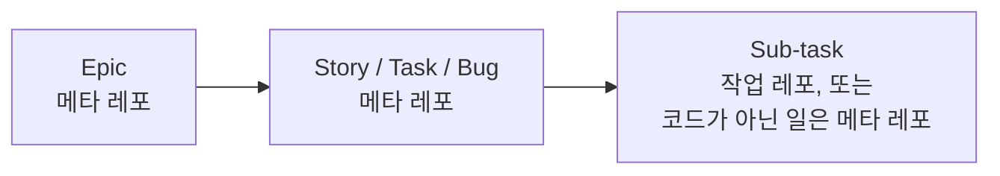
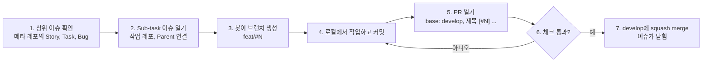

# 이슈에서 머지까지

SSCCOps의 작업은 모두 이슈에서 시작해 `develop`에 squash merge되는 것으로 끝납니다. 이 문서는 이슈가 어떤 계층으로 묶이는지 설명하고, 변경 하나를 처음부터 끝까지 따라갑니다. 첫 Sub-task를 맡기 전에 읽습니다.

커밋과 PR 형식의 세부는 [커밋, 브랜치, PR 규칙](./commit-branch-pr.md)에, PR에서 도는 검사는 [CI 검사](./ci.md)에 있습니다.

## 레포 넷과 각자의 자리

| 레포 | 공개 | 여기에 두는 것 |
|---|---|---|
| `ssccops` (메타 레포) | 비공개 | 상위 이슈(Epic, Story, Task, Bug), 결정 기록(ADR), 기획 문서 |
| `ssccops-server` | 공개 | 서버 코드와 그 코드의 Sub-task 이슈 |
| `ssccops-web` | 공개 | 웹 코드와 그 코드의 Sub-task 이슈 |
| `ssccops-site` | 공개 | 이 사이트의 글과 코드, 그 Sub-task 이슈 |

계획은 언제나 메타 레포에서 하고, 작업 레포 셋에는 실제로 손을 움직이는 Sub-task만 둡니다. 메타 레포는 비공개라 조직 구성원만 열 수 있습니다. 조직 밖에서 참여한다면 연결할 상위 이슈 번호는 운영진에게 받습니다.

## 이슈 계층

이슈는 Epic, Story/Task/Bug, Sub-task 순서로 묶입니다. 다섯 종류 모두 GitHub의 Issue Type으로 등록되어 있어서 이슈 화면의 Type 칸에 그대로 보입니다.



| 종류 | 만드는 곳 | 언제 |
|---|---|---|
| Epic | 메타 레포 | 여러 이슈를 묶는 상위 목표. 직접 작업하지 않습니다 |
| Story | 메타 레포 | 성립해야 하는 동작 하나. 가장 많이 씁니다 |
| Task | 메타 레포 | Story로 표현되지 않는 독립 작업. 결정이 필요한 일은 제목을 `[DECISION]`으로 엽니다 |
| Bug | 메타 레포 | 결함 |
| Sub-task | 작업 레포(코드, 사이트) 또는 메타 레포(코드가 아닌 일) | 위 셋을 쪼갠 가장 작은 실행 단위 |

지키는 규칙은 셋입니다.

1. **Sub-task는 언제나 Story, Task, Bug의 자식입니다.** Epic 밑에 Sub-task를 바로 달지 않고, Sub-task가 다시 자식을 갖지도 않습니다.
2. 작업 레포의 Sub-task는 메타 레포의 상위 이슈를 Parent로 잇습니다. GitHub Sub-issues는 레포가 달라도 부모와 자식을 이을 수 있습니다(cross-repo).
3. 작업 레포에는 Sub-task만 엽니다. 세 레포 모두 빈 이슈를 막아 두었고(`blank_issues_enabled: false`), 새 이슈 화면에는 Sub-task 템플릿만 나옵니다.

### 왜 계층을 지키나

**진행률이 위로 모입니다.** Story에 이어진 Sub-task가 닫히면 레포가 달라도 그 Story의 진행률이 오릅니다. Parent를 잇지 않은 Sub-task는 아무리 닫아도 상위 이슈는 «구현 안 됨»으로 남습니다.

**보드에서 보입니다.** 조직 보드의 «Epic별» 뷰는 Parent로 묶어 보여 줍니다. 부모 사슬이 Epic, Task, Bug 중 하나에 닿지 않는 이슈는 그 뷰에서 어디에도 잡히지 않습니다. 그래서 Story는 Epic이 필수이고, Sub-task는 상위 이슈가 필수입니다.

Task와 Bug는 목표 없이 독립으로 둘 수 있습니다. 그때는 Epic별 뷰에 안 보이니 보드의 Priority를 꼭 채웁니다(결정 기록 ADR-0015).

**«왜 이 변경을 했나»를 거슬러 올라갈 수 있습니다.** PR에서 Sub-task로, Sub-task에서 상위 이슈로, 상위 이슈에서 결정 기록으로 이어지는 사슬이 있어야 나중에 이유를 찾을 수 있습니다. PR 본문의 «근거» 줄이 이 사슬의 첫 고리입니다([커밋, 브랜치, PR 규칙](./commit-branch-pr.md#pr-본문)).

## 변경 하나 따라가기

서버에 기능 하나를 더하는 경우로 따라갑니다. 웹과 사이트도 같은 순서입니다.



### 1. 상위 이슈를 확인합니다

작업은 메타 레포의 Story, Task, Bug 가운데 하나에서 출발합니다. 그 이슈 번호가 다음 단계에서 Parent가 됩니다. 새 기능 요청이면 Story부터 만들고, 바로 Sub-task를 만들지 않습니다.

### 2. 작업 레포에 Sub-task 이슈를 엽니다

작업 레포의 New issue에서 템플릿 넷 가운데 하나를 고릅니다.

| 템플릿 | 제목 접두어 | 언제 |
|---|---|---|
| Feat | `[FEAT] ` | 새 기능 |
| Fix | `[FIX] ` | 결함 수정 |
| Refactor | `[REFACTOR] ` | 동작을 바꾸지 않는 구조 개선 |
| Chore | `[CHORE] ` | 문서, 테스트, CI, 빌드 설정 |

사이트 레포에는 글 작업용 `[DOCS]` 템플릿이 하나 더 있습니다(아래 «사이트 글 작업은 레포 안에서 끝납니다»).

**제목 앞 접두어를 지우지 않습니다.** 봇이 이 접두어로 브랜치 이름과 라벨을 정합니다.

템플릿의 «📄 설명»에는 무엇을 만드는지보다 왜 필요한지를 먼저 적습니다. «🚫 검토했으나 택하지 않은 길»에는 따져 본 대안과 기각 이유를 적습니다. 이슈를 만든 뒤 이슈 화면 오른쪽의 Parent issue에서 1단계의 상위 이슈를 잇습니다.

### 3. 봇이 브랜치를 만듭니다

이슈가 열리면 `issue-branch-creator.yml` 워크플로가 제목의 접두어를 읽어 `{유형}/#{이슈번호}` 브랜치를 만들고, 이슈에 «🌿 브랜치가 생성되었습니다» 코멘트를 남깁니다. 같은 때 `issue-labeler.yml`이 같은 표로 라벨을 붙입니다.

| 제목 접두어 | 브랜치 | 라벨 |
|---|---|---|
| `[FEAT]` | `feat/#N` | `feat` |
| `[FIX]` (별칭 `[BUG]`) | `fix/#N` | `fix` |
| `[REFACTOR]` | `refactor/#N` | `refactor` |
| `[CHORE]` (별칭 `[DOCS]`, `[TEST]`, `[CICD]` 등) | `chore/#N` | `chore` |

알아 둘 점이 있습니다.

- 브랜치 이름 뒤에 설명(슬러그)이 붙지 않습니다. 이슈 번호만으로 이름이 정해지므로 누가 먼저 만들어도 같은 브랜치가 됩니다. 일부 이슈 템플릿 안내문에는 아직 `feat/#번호-...`라고 적혀 있지만 실제로 만들어지는 이름은 `feat/#번호`입니다.
- 접두어가 없으면 `feat`으로 처리하고 그 사실을 이슈 코멘트로 남깁니다.
- 브랜치 자동 생성은 이슈가 열릴 때 한 번뿐입니다. 나중에 제목을 고쳐도 브랜치는 다시 만들어지지 않습니다. 접두어를 잘못 달았다면 제목과 라벨을 고치고, 봇이 만든 브랜치를 지운 뒤 직접 만듭니다.

:::warning[브랜치를 직접 만들 때는 develop에서 땁니다]
다른 사람의 작업 브랜치 위에서 따면 그 브랜치의 변경까지 함께 머지됩니다. 서버 레포에서 문서 한 줄을 고친 PR이 남의 파일 61개를 함께 머지한 일이 있었습니다.
:::

### 4. 로컬에서 작업합니다

```bash
git fetch origin
git switch feat/#123
```

작업하고 커밋합니다. 커밋 메시지 형식은 [커밋, 브랜치, PR 규칙](./commit-branch-pr.md)에 있습니다. PR을 올리기 전에 CI와 같은 검사를 로컬에서 먼저 돌려 두면 왕복이 줄어듭니다([CI 검사](./ci.md)).

### 5. PR을 엽니다

- base 브랜치는 `develop`입니다.
- **제목은 `[#이슈번호] 총 작업 내용`입니다.** squash merge에서 이 제목이 그대로 `develop`의 커밋 제목이 됩니다.
- 본문은 PR 템플릿을 채웁니다. «🍀 이슈 번호»의 `- closed: #123`이 머지될 때 이슈를 닫고, PR의 타입 라벨도 그 이슈에서 가져옵니다. «근거» 줄에는 이 변경이 나온 메타 이슈나 결정 기록 번호를 적습니다.

### 6. 체크를 봅니다

PR을 열면 컨벤션 검사(`pr-guard`), 라벨러(`pr-labeler`), 레포별 통합 검사가 돕니다. 빨간 체크가 있으면 그 job의 로그와 Annotations를 봅니다. 어느 검사가 무엇을 보는지는 [CI 검사](./ci.md)에 있습니다.

서버와 사이트 레포는 `.github/CODEOWNERS`가 있어서, 바뀐 경로의 담당자에게 리뷰 요청이 자동으로 갑니다. 머지 조건으로 강제하지는 않습니다. 웹 레포에는 CODEOWNERS 파일이 없습니다.

### 7. develop에 squash merge합니다

기능과 수정 PR은 **Squash and merge**로 `develop`에 커밋 하나로 들어갑니다. 저장소 설정상 커밋이 하나뿐인 PR에서도 PR 제목이 커밋 제목이 됩니다. 머지되면 `closed:`로 이은 이슈가 닫힙니다.

머지 뒤의 일은 자동입니다. 서버와 웹은 `develop`이 dev 환경으로, `main`이 prod 환경으로 자동 배포됩니다. 사이트는 `develop` 머지가 곧 발행입니다.

## main은 릴리즈 전용입니다

서버와 웹에서 `main`으로 가는 것은 `develop → main` 릴리즈 PR뿐입니다. 이 PR은 squash가 아니라 일반 merge commit으로 머지합니다. squash하면 릴리즈에 무엇이 들어갔는지가 커밋 하나로 뭉개지기 때문입니다.

릴리즈 PR에는 이슈 번호가 없는 것이 정상이라 `pr-guard`가 검사하지 않습니다. 사이트 레포에는 `main`이 없습니다.

## 보드

이슈는 조직 수준의 Projects 보드 하나에 모입니다. 레포마다 새 이슈가 보드에 자동으로 추가됩니다.

| 칸 | 뜻 | 누가 옮기나 |
|---|---|---|
| Backlog | 등록됨. 아직 착수 계획 없음 | 자동(보드에 추가될 때) |
| Ready | 선행 이슈가 끝나 바로 시작할 수 있음 | 사람 |
| In progress | 작업 중 | 사람 |
| In review | PR이 올라가 리뷰 대기 | 사람 |
| Done | 끝남 | 자동(닫히거나 PR이 머지될 때) |

가운데 세 칸은 아무도 옮기지 않으면 진행 중인 일이 Backlog로 보입니다. 착수하면 In progress로, PR을 올리면 In review로 옮깁니다.

In progress는 한 사람당 두 개까지 두고, 넘으면 새로 시작하기보다 끝내는 일을 먼저 합니다. 막힌 카드는 칸을 옮기지 않고 이유를 코멘트로 남깁니다. 칸은 조용하지만 코멘트는 알림이 갑니다.

## 결정이 필요하면 ADR로 남깁니다

되돌리기 어려운 결정, 여러 컴포넌트에 걸치는 결정, 운영이나 보안에 영향을 주는 결정은 결정 기록(ADR)으로 남깁니다. 포매터 설정이나 변수 이름처럼 되돌리기 쉬운 것은 쓰지 않습니다. 판단이 서지 않으면 «6개월 뒤에 누가 이걸 보고 왜 이렇게 했는지 물을까?»를 묻습니다.

흐름은 이렇습니다.

1. 메타 레포에 제목이 `[DECISION]`인 Task 이슈를 엽니다. 무엇을 정해야 하는지, 안 정하면 무엇이 막히는지, 기한 셋만 적고 선택지와 권고안은 코멘트로 주고받습니다.
2. 결정이 나면 메타 레포에 ADR 한 장을 씁니다. 채택된 ADR의 본문은 고치지 않고, 생각이 바뀌면 새 ADR을 써서 옛 것을 대체합니다.
3. `[DECISION]` 이슈에 ADR 링크를 달고 닫습니다. ADR 링크 없이는 닫지 않습니다.

ADR은 «왜»를, 코드 주석은 «어떻게»를 맡습니다. 코드에서 결정을 가리킬 때는 주석에 `ADR-0003 참고`처럼 번호를 적습니다. ADR은 메타 레포에 있어 공개되지 않으므로, 이 사이트에서는 «결정 기록(ADR-0018)»처럼 번호와 요지만 씁니다.

## 사이트 글 작업은 레포 안에서 끝납니다

이 사이트(`ssccops-site`)의 글 작업은 다른 길을 갑니다(결정 기록 ADR-0061).

- **`[DOCS]` 템플릿으로 엽니다.** 블로그 글, 사용 설명서, 개발 참여 문서를 쓰거나 고칠 때입니다. 이슈 유형은 넷뿐이라 라벨은 `chore`, 브랜치는 `chore/#N`이 됩니다.
- 메타 레포의 부모 이슈를 잇지 않습니다. 글은 메타 레포의 결정에서 나오지 않습니다.
- PR 본문의 «근거»를 비워 둡니다. `pr-guard`는 이슈 제목이 `[DOCS]`로 시작하면 근거를 보지 않습니다.

사이트의 기능이나 구조를 바꾸는 작업(문서 묶음 열기, 댓글, 검색, 설정)은 글 작업이 아니므로 다른 레포처럼 메타 레포의 상위 이슈를 Parent로 잇습니다. 사이트 규칙의 원본은 [ssccops-site `AGENTS.md`](https://github.com/SoongSilComputingClub/ssccops-site/blob/develop/AGENTS.md)입니다.

## 다음 읽을 것

- [커밋, 브랜치, PR 규칙](./commit-branch-pr.md): 첫 커밋과 PR 제목, 근거 줄을 쓰기 전에 봅니다.
- [CI 검사](./ci.md): PR에서 빨간 체크가 떴을 때, 그리고 로컬에서 먼저 돌릴 명령을 찾을 때 봅니다.
