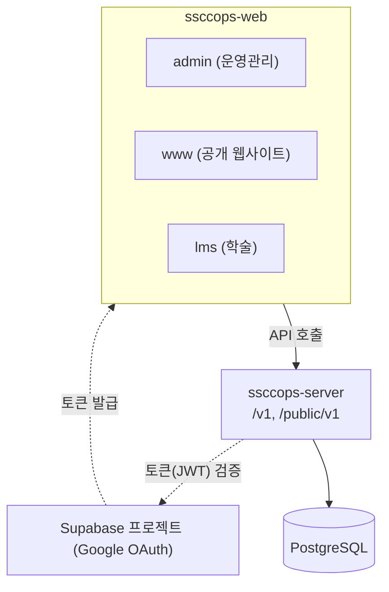

# SSCCOps 한눈에 보기

코드를 열기 전에 SSCCOps의 전체 모양을 잡는 문서입니다. 무엇을 하는 시스템인지, 레포와 앱이 어떻게 나뉘는지, 이 문서 묶음을 어떤 순서로 읽으면 되는지 다룹니다.

## SSCCOps는 무엇인가

SSCCOps는 숭실컴퓨팅클럽(SSCC)이 동아리 운영에 필요한 일을 한 곳에서 다루려고 만든 시스템입니다. 다루는 일은 다음과 같습니다.

- 업무와 회의, 결재
- 회원과 권한
- 폼과 응답
- 학술 프로그램(스터디, 프로젝트, 트랙)
- 행사와 참가 신청
- 공개 사이트의 홍보 콘텐츠
- 알림과 웹 푸시

쓰는 사람은 크게 셋입니다.

| 누가 | 주로 쓰는 앱 | 하는 일 |
|---|---|---|
| 운영진 | admin | 회원, 업무, 회의, 승인함, 폼, 행사, 학술, 콘텐츠를 관리합니다 |
| 스터디장 | lms | 자기 학술 프로그램의 회차와 출석을 다루고 기획안을 냅니다 |
| 회원 | www, lms | 행사를 보고 신청하고, 내 활동과 내 신청을 확인합니다 |

## 레포 셋과 비공개 메타 레포

코드는 공개 레포 셋에 나뉘어 있습니다.

| 레포 | 무엇 | 기술 |
|---|---|---|
| [ssccops-server](https://github.com/SoongSilComputingClub/ssccops-server) | API 서버 하나. 위의 업무를 모두 맡습니다 | Spring Boot 3.5, Java 17, Gradle, PostgreSQL, Flyway |
| [ssccops-web](https://github.com/SoongSilComputingClub/ssccops-web) | 웹 앱 셋(admin, www, lms)과 공용 패키지 | Next.js 16(App Router), React 19, TypeScript 5, Tailwind CSS v4, pnpm workspace와 Turborepo |
| [ssccops-site](https://github.com/SoongSilComputingClub/ssccops-site) | 지금 보고 있는 이 사이트. 사용 설명서, 블로그, 개발 참여 문서 | Docusaurus |

이 밖에 기획과 이슈 관리를 위한 **비공개 메타 레포**가 따로 있습니다. 운영 요구, Epic과 Story 같은 상위 이슈, 결정 기록(ADR)이 그곳에 모입니다. 그래서 작업 레포의 PR 본문에는 메타 레포 이슈를 가리키는 근거 줄이 들어갑니다.

메타 레포는 조직 구성원만 볼 수 있습니다. 이 사이트에서는 결정 기록을 «결정 기록(ADR-0032)»처럼 번호와 요지로만 소개합니다.

개발 규칙의 원본은 각 레포의 `AGENTS.md`입니다. 서버는 도메인마다, 웹은 앱과 패키지마다 자기 `AGENTS.md`를 따로 둡니다. 이 문서 묶음은 그 규칙을 옮겨 적지 않고, 읽는 순서와 이유를 풀어 준 뒤 원본으로 연결합니다.

## 앱 셋, 서버 하나

웹 앱 셋은 모두 **같은 API 서버 하나**를 부릅니다. 로그인도 셋이 같은 Supabase 프로젝트(Google OAuth)를 씁니다. 같은 계정으로 로그인한 사람이 서버에서 같은 회원으로 식별되어야 하기 때문입니다.

세 앱 모두 같은 Supabase 프로젝트에서 토큰을 받고, 서버는 그 토큰(JWT)을 검증합니다.

| 앱 | 무엇 | 로그인 | 로컬 개발 포트 |
|---|---|---|---|
| `apps/admin` | 운영진용 어드민. 회원, 업무, 회의, 승인함, 폼, 행사, 학술, 공유 링크를 다룹니다 | 필수 | 3000 |
| `apps/www` | 공개 웹사이트. 동아리 소개, 행사, 콘텐츠, 공개 폼, 내 활동(`/me`)을 보여 줍니다 | 본체는 없음. 신청과 내 활동에서만 필요 | 3001 |
| `apps/lms` | 학술 앱. 스터디장 스튜디오, 기획안, 내 신청을 다룹니다 | 필수 | 3002 |

세 앱은 서로 소스를 공유하지 않습니다. 두 앱 이상이 실제로 함께 쓰게 된 것만 `packages/` 아래 공용 패키지로 올립니다. 자세한 구조는 [웹 구조](../web/structure.md)에서 다룹니다.

서버는 도메인별 패키지로 나뉩니다. 업무(`operation`), 회원(`member`), 폼(`form`), 행사(`event`), 학술 프로그램(`academicprogram`), 콘텐츠(`content`), 알림(`notification`), 파일(`file`), 공유 링크(`share`), 규정 도우미(`assistant`), 인증(`auth`)이 있습니다.

주소는 로그인이 필요한 `/v1`과 익명으로 열리는 `/public/v1` 두 갈래입니다. 자세한 구조는 [서버 구조](../server/structure.md)에서 다룹니다.

## 브랜치와 배포

세 레포 모두 기능 작업은 `develop`으로 squash 머지하고, `main`은 릴리즈에만 씁니다. **`develop`은 dev 환경으로, `main`은 prod 환경으로 자동 배포됩니다.** 배포 설정의 세부는 조직 구성원용 문서에서 다룹니다.

## 이 문서 묶음을 읽는 순서

처음 참여한다면 아래 순서를 권합니다.

1. [한눈에 보기](./overview.md): 지금 이 문서입니다.
2. [로컬 개발 환경](./local-setup.md): 서버와 웹을 내 컴퓨터에서 띄웁니다. 이것이 되어야 나머지를 직접 확인할 수 있습니다.
3. [요청 하나 따라가기](./request-flow.md): 회원이 www에서 행사에 신청할 때 화면에서 DB까지 무엇이 지나가는지 따라갑니다. 서버와 웹이 어디서 만나는지 보여 주는 지도 역할을 합니다.
4. 첫 PR까지: [이슈에서 머지까지](../contribute/workflow.md), [커밋, 브랜치, PR 규칙](../contribute/commit-branch-pr.md), [CI 검사](../contribute/ci.md).
5. 코드를 고치기 시작할 때
   - 서버: [서버 구조](../server/structure.md), [API 약속](../server/api-contract.md), [데이터베이스와 스키마 변경](../server/database.md)
   - 웹: [웹 구조](../web/structure.md), [FSD와 슬라이스](../web/fsd.md), [서버 API 부르기](../web/talking-to-server.md)
6. 첫 달 안에: [테스트](../server/testing.md), [용어집](../contribute/glossary.md), 결정 기록 요약.

그다음은 고치려는 레포의 `AGENTS.md`를 직접 읽습니다. 서버는 [ssccops-server AGENTS.md](https://github.com/SoongSilComputingClub/ssccops-server/blob/develop/AGENTS.md), 웹은 [ssccops-web AGENTS.md](https://github.com/SoongSilComputingClub/ssccops-web/blob/develop/AGENTS.md)에서 시작합니다.

## 다음 읽을 것

- [로컬 개발 환경](./local-setup.md): 서버와 웹 앱 셋을 내 컴퓨터에서 띄웁니다.
- [요청 하나 따라가기](./request-flow.md): 행사 신청 하나로 웹과 서버가 만나는 자리를 봅니다.
