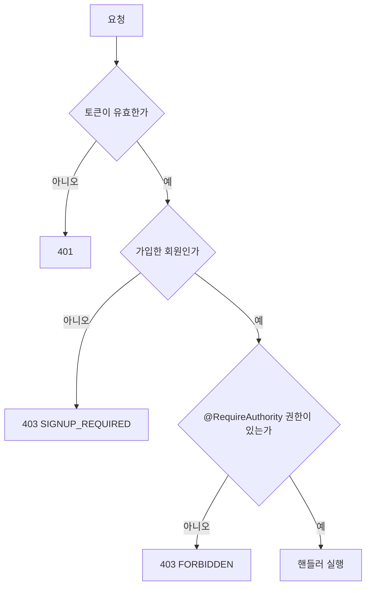

# API 약속

서버의 모든 엔드포인트가 지키는 응답, 에러, 인증 약속을 모았습니다. 웹은 이 약속을 믿고 응답을 읽으므로, 새 API를 만들 때도 같은 모양을 따릅니다.

코드 위치는 `global/apipayload`와 `global/security`이고, 규칙의 원본은 서버 [`AGENTS.md`](https://github.com/SoongSilComputingClub/ssccops-server/blob/develop/AGENTS.md)의 «전역» 절입니다.

## 응답 봉투

모든 응답은 [`ApiResponse<T>`](https://github.com/SoongSilComputingClub/ssccops-server/blob/develop/src/main/java/org/sscc/ssccopsserver/global/apipayload/ApiResponse.java) 하나로 감쌉니다. 필드는 다섯 개입니다.

| 필드 | 뜻 |
|---|---|
| `success` | 성공 여부 |
| `code` | 성공 코드 또는 에러 코드 문자열 |
| `message` | 사람이 읽는 문장 |
| `data` | 실제 응답 내용. 실패하면 `null` |
| `page` | 목록 응답에만 실리는 페이지 정보. 단건과 오류 응답에서는 빠집니다 |

```json
{
  "success": true,
  "code": "...",
  "message": "...",
  "data": { }
}
```

생성자는 private이라 정적 팩터리로만 만듭니다.

| 팩터리 | 쓰는 경우 |
|---|---|
| `success(data)` | 일반 성공 |
| `success(data, page)` | 목록 조회 |
| `successWithNoData()` | 돌려줄 내용이 없는 성공 |
| `created(data)`, `createdWithNoData()` | 생성 |
| `fail(errorCode)`, `fail(errorCode, message)` | 실패. 보통 직접 부르지 않고 아래 예외 처리기가 만듭니다 |

:::note[봉투를 쓰지 않는 예외 하나]

규정 도우미의 SSE 스트리밍(`POST /v1/assistant/queries/stream`)은 스트림 안의 이벤트에 봉투를 씌우지 않습니다. 한 응답 안에서 이벤트가 여러 번 나가기 때문입니다.

대신 오류 이벤트는 봉투와 같은 필드 이름(`code`, `message`)을 씁니다. 스트림이 열리기 전의 거절은 다른 API와 똑같이 상태 코드와 봉투로 나갑니다.

:::

## 에러 처리

흐름은 세 단계입니다.

1. **에러 코드를 정합니다.** [`ErrorCode`](https://github.com/SoongSilComputingClub/ssccops-server/blob/develop/src/main/java/org/sscc/ssccopsserver/global/apipayload/code/error/ErrorCode.java)는 HTTP 상태, 코드 문자열, 메시지를 가진 인터페이스입니다. 전역 에러는 `CommonErrorCode`가, 도메인 전용 에러는 각 도메인의 `code/error/XxxErrorCode` enum이 구현합니다(`MemberErrorCode`, `FormErrorCode` 등). 새 에러를 더할 때는 전역에 둘지 도메인에 둘지 먼저 정합니다.
2. **서비스가 [`GeneralException`](https://github.com/SoongSilComputingClub/ssccops-server/blob/develop/src/main/java/org/sscc/ssccopsserver/global/apipayload/exception/GeneralException.java)을 던집니다.** `ErrorCode` 하나를 감싸고, 화면에 보여 줄 구체적인 사유가 있으면 두 번째 인자로 넘깁니다. 이 사유는 사용자에게 그대로 보이므로 예외 메시지나 스택을 넣지 않습니다.
3. **[`GlobalExceptionHandler`](https://github.com/SoongSilComputingClub/ssccops-server/blob/develop/src/main/java/org/sscc/ssccopsserver/global/apipayload/handler/GlobalExceptionHandler.java)가 응답으로 바꿉니다.** `GeneralException`은 감싼 코드 그대로, 검증 실패나 읽을 수 없는 본문 같은 스프링 기본 예외는 `CommonErrorCode`로 바꿔 언제나 `ApiResponse.fail(...)` 모양으로 내보냅니다.

**컨트롤러에 try/catch를 두지 않습니다.** 예외는 처리기 한 곳이 응답으로 바꿉니다.

## 주소 체계

| 접두사 | 누가 부르나 |
|---|---|
| `/v1/...` | 로그인한 사용자. 토큰이 없으면 401입니다 |
| `/public/v1/...` | 익명 사용자. 공개 사이트가 읽는 게시된 콘텐츠, 공개 행사, 접수 중인 폼 등 |

익명 접근은 경로 접두사 하나로만 엽니다. `/v1` 아래에 익명 경로를 섞으면 경로마다 예외를 적는 표가 생기고, 한 줄이 빠지거나 패턴이 넓게 잡혀 인증이 필요한 자원이 열릴 수 있기 때문입니다.

그래서 **`/public/v1` 아래에 핸들러를 더하는 것은 익명 접근을 여는 것과 같습니다.** 이 층의 응답은 공개해도 되는 필드만 담은 별도 record(`Public*`)를 씁니다.

## 인증

로그인은 Supabase Auth가 맡고, 서버는 Supabase가 발급한 JWT를 OAuth2 리소스 서버로 **검증만** 합니다(`spring-boot-starter-oauth2-resource-server`). 서버가 토큰을 발급하지 않습니다.

- 서명은 Supabase 프로젝트의 JWKS로 확인하고, 발급자(`iss`)와 대상(`aud`)도 봅니다(`global/security/jwt/SupabaseJwtValidators`).
- 토큰의 `sub`로 회원을 조회만 합니다. 인증 시점에 회원을 만들지 않으므로 «로그인했지만 아직 가입하지 않은 사용자»가 존재할 수 있습니다. 회원 행은 회원가입 API에서만 생깁니다.
- 회원이 필요한 핸들러는 인자로 `@CurrentMember MemberEntity`를 받습니다. 미가입 사용자는 이 자리에서 막히므로 주입된 값은 언제나 null이 아닙니다.

## 인가

권한이 필요한 핸들러에는 [`@RequireAuthority`](https://github.com/SoongSilComputingClub/ssccops-server/blob/develop/src/main/java/org/sscc/ssccopsserver/global/security/authorization/RequireAuthority.java)를 붙입니다.

```java
@RequireAuthority(AuthorityCode.ACADEMIC_PROGRAM_MANAGE)
```

- 애노테이션에는 하려는 일(권한 코드, `AuthorityCode` enum)만 적습니다. 어떤 역할이 그 일을 할 수 있는지는 운영진이 화면에서 바꾸는 데이터가 정합니다. 그래서 코드에 역할 이름이 나오지 않습니다.
- 클래스에 붙이면 컨트롤러 전체에, 메서드에 붙이면 그 핸들러에 걸리고 메서드 쪽이 이깁니다. 붙이지 않은 엔드포인트는 인증만 요구합니다.
- 판정 규칙은 `domain/member/service/AuthorityPolicy` 한 곳에 있습니다. 회원의 유효한 역할에 부여된 권한을 모으고, 권한 트리를 따라 자손까지 펼칩니다.
- 권한은 부모가 하나인 트리이고 최상위가 `SUPER`입니다. 그래서 상위 권한을 가진 회원은 그 아래 권한이 필요한 API도 통과합니다.
- 새 권한 코드를 만들면 트리에 매달아야 `SUPER`가 그것을 포함합니다.

### 거절 순서

거절은 언제나 이 순서로 나갑니다. 404로 감추지 않습니다.



| 순서 | 상황 | 응답 |
|---|---|---|
| 1 | 토큰이 없거나 무효 | 401 |
| 2 | 로그인했지만 미가입 | 403, 코드 `SIGNUP_REQUIRED` |
| 3 | 가입했지만 권한 부족 | 403, 코드 `FORBIDDEN` |

웹은 `SIGNUP_REQUIRED`를 받으면 다시 로그인시키지 않고 가입 화면으로 보냅니다. 요청 본문이 `@Valid` 검증을 어기면 권한 판정보다 먼저 400이 나갈 수 있습니다.

화면 버튼을 켜고 끄는 데 쓰는 권한 목록은 `GET /v1/auth/session` 응답의 `capabilities`로 내려갑니다. 같은 정책으로 계산하므로 버튼과 실제 판정이 갈리지 않습니다.

## 목록과 페이징

목록은 offset이 아니라 **커서 기반**으로 페이징합니다. 목록을 읽는 사이에 데이터가 추가되어도 항목이 중복되거나 빠지지 않게 하기 위해서입니다. 목록 응답은 `data`에 배열을, `page`에 [`PageResponse`](https://github.com/SoongSilComputingClub/ssccops-server/blob/develop/src/main/java/org/sscc/ssccopsserver/global/apipayload/PageResponse.java)를 싣습니다.

| `page` 필드 | 뜻 |
|---|---|
| `size` | 요청한 크기 |
| `sort` | 서버가 실제로 적용한 정렬. 다음 요청에 되돌려 주면 정렬이 흔들리지 않습니다 |
| `nextCursor` | 다음 페이지를 요청할 때 `cursor`로 넘기는 값 |
| `hasNext` | 다음 페이지가 있는지 |
| `totalCount`, `overallCount` | 걸러진 건수와 전체 건수 |

페이지 번호(`page`, `totalPages`) 개념은 두지 않습니다.

## Swagger

springdoc이 코드의 애노테이션에서 OpenAPI 문서를 만듭니다. Swagger UI는 local과 dev에서 열리고 prod에서는 꺼져 있습니다(`SwaggerConfig`는 `@Profile("!prod")`, `application-prod.yaml`에서 springdoc 비활성). 로컬에서는 서버를 띄운 뒤 `http://localhost:8080/swagger-ui.html`로 엽니다.

## 깨는 변경은 CI가 막습니다

결정 기록(ADR-0032)의 요지는 «API 계약을 깨는 변경은 CI가 막고, 추가는 통과시킨다»입니다. 서버와 웹이 다른 레포라 응답 모양이 어긋나도 사람이 대조하기 전에는 아무도 모르기 때문에 들였습니다.

- PR마다 `integrate-dev.yml`의 `api-compat` job이 base와 PR 양쪽에서 OpenAPI 문서를 뽑아 `oasdiff`로 비교합니다.
- 막는 것: 응답 필드 삭제, 이름이나 타입 변경, 요청 필드를 필수로 바꾸기, 엔드포인트나 enum 값 삭제
- 통과하는 것: 필드, 엔드포인트, 선택 파라미터 추가
- 의도한 깨는 변경이면 PR에 **`api-breaking-approved`** 라벨을 붙이고 job을 다시 돌립니다. 이때는 마이너 버전을 올리고 릴리즈 노트에 마이그레이션 항목을 적어야 합니다.
- 문서가 애노테이션에서 만들어지므로 애노테이션을 빠뜨린 변경은 잡지 못합니다.

자세한 판정 기준은 [`config/oasdiff/README.md`](https://github.com/SoongSilComputingClub/ssccops-server/blob/develop/config/oasdiff/README.md)와 서버 `AGENTS.md`의 «OpenAPI 하위 호환 게이트» 항목에 있습니다. CI 전체는 [CI 검사](../contribute/ci.md)에서 다룹니다.

## 다음 읽을 것

- [요청 하나 따라가기](../getting-started/request-flow.md): 요청 하나가 웹에서 서버를 거쳐 돌아오는 길
- [서버 API 부르기](../web/talking-to-server.md): 웹 쪽에서 이 약속을 읽는 법
- [서버 구조](./structure.md): 이 약속이 놓인 패키지와 도메인 구조
