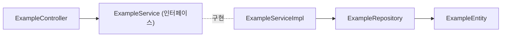
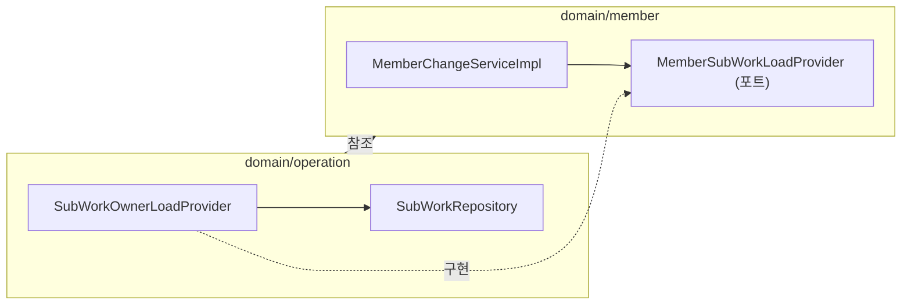

# 서버 구조

ssccops-server를 처음 열었을 때 어디에 무엇이 있는지 보여 주는 지도입니다. 서버 코드를 고치기 전에 한 번 읽어 두면 됩니다.

규칙의 원본은 레포의 [`AGENTS.md`](https://github.com/SoongSilComputingClub/ssccops-server/blob/develop/AGENTS.md)입니다. 이 문서는 그 «아키텍처», «도메인», «전역» 절을 읽기 전에 볼 요지만 담습니다.

## 기술 스택

| 항목 | 값 | 확인한 곳 |
|---|---|---|
| 언어 | Java 17 | `build.gradle`의 toolchain |
| 프레임워크 | Spring Boot 3.5.9 | `build.gradle` 플러그인 |
| 빌드 | Gradle 8.14.3, 단일 모듈 | `gradle/wrapper/gradle-wrapper.properties`, `settings.gradle` |
| DB | PostgreSQL (로컬 compose는 `postgres:17` 이미지) | `docker-compose.yml` |
| 데이터 접근 | Spring Data JPA | `build.gradle` |
| 스키마 관리 | Flyway | [데이터베이스와 스키마 변경](./database.md) |
| 인증 | Spring Security OAuth2 Resource Server | [API 약속](./api-contract.md) |
| API 문서 | springdoc-openapi 2.8.9 | `build.gradle` |
| 테스트 | JUnit 5, H2, ArchUnit 1.3.0, Testcontainers | `build.gradle` |

이 밖에 규정 도우미와 MCP 서버에 쓰는 Spring AI(1.1.x BOM)가 들어 있습니다. 이 부분은 [서버 안의 부가 기능](./extras.md)에서 다룹니다.

## 패키지 구조

루트 패키지는 `org.sscc.ssccopsserver`이고 Gradle group은 `org.sscc`입니다. 그 아래가 둘로 나뉩니다.

```text
src/main/java/org/sscc/ssccopsserver/
├── SsccopsServerApplication.java
├── domain/     업무 기능. 도메인 하나가 폴더 하나
└── global/     모든 도메인이 기대는 공통 층
```

`global/` 아래에는 다음 폴더가 있습니다.

| 폴더 | 하는 일 |
|---|---|
| `apipayload` | 응답 봉투 `ApiResponse`, 에러 코드, `GeneralException`, `GlobalExceptionHandler` |
| `security` | Supabase JWT 검증, `@CurrentMember`, `@RequireAuthority` |
| `config` | 스프링 설정 빈(Swagger, 스케줄링, 오브젝트 스토리지 연결 등) |
| `audit`, `logging` | 감사 로그와 로그 형식 |
| `mcp` | MCP 서버 도구 |
| `crawler` | 검색 크롤러에게 내주는 `/robots.txt` |
| `db` | DB 연결을 살려 두는 예약 작업 |

## 도메인 안에서 계층을 반복합니다

도메인 폴더마다 같은 하위 폴더를 둡니다. 계층이 위에 있고 도메인이 아래에 있는 구조가 아니라, 도메인이 위에 있고 그 안에 계층이 반복되는 구조입니다.

요청은 한 도메인 안에서 컨트롤러, 서비스, 리포지토리 순으로 내려갑니다. `example` 도메인으로 보면 다음과 같습니다.



| 하위 폴더 | 담는 것 |
|---|---|
| `controller` | REST 컨트롤러 |
| `service` | 서비스 인터페이스와 구현, 판정 규칙(`*Policy`), 다른 도메인에 묻는 포트 인터페이스 |
| `repository` | Spring Data JPA 리포지토리 |
| `entity` | JPA 엔티티와 그 안의 enum |
| `dto` | 요청과 응답 record |
| `code` | 도메인 전용 코드 enum과 `code/error`의 에러 코드 |

모든 도메인이 여섯 개를 다 갖지는 않습니다. `auth`는 `controller`, `dto`, `service`만 있고 `file`은 컨트롤러가 없습니다. 도메인 이벤트를 내는 도메인에는 `event` 폴더가, 알림 도메인에는 웹 푸시를 맡는 `push` 폴더가 더 있습니다.

폴더 이름이 `domain/`이지만 DDD 전술 패턴을 모두 쓰지는 않습니다. 엔티티가 상태 전이와 그 검증을 직접 맡는 것은 따릅니다. 애그리게이트 경계는 두지 않아서 리포지토리가 엔티티마다 하나입니다. 도메인 이벤트 중심 설계도 아닙니다. 자세한 수치와 이유는 루트 `AGENTS.md` «아키텍처» 절에 있습니다.

## 도메인 목록

`domain/` 아래 도메인은 12개입니다. 각 도메인의 고유 규칙(상태 전이, 인가, 테스트 함정 등)은 그 폴더의 `AGENTS.md`가 원본입니다.

| 도메인 | 한 줄 설명 | 규칙 원본 |
|---|---|---|
| `member` | 회원, 등급과 상태, 역할 배정, 권한 트리, 가입과 계정 연결, 명부 가져오기 | [AGENTS.md](https://github.com/SoongSilComputingClub/ssccops-server/blob/develop/src/main/java/org/sscc/ssccopsserver/domain/member/AGENTS.md) |
| `operation` | 업무, 하위 업무(전이, 승인, 투표, 체크리스트), 회의, 승인함, 대시보드 | [AGENTS.md](https://github.com/SoongSilComputingClub/ssccops-server/blob/develop/src/main/java/org/sscc/ssccopsserver/domain/operation/AGENTS.md) |
| `form` | 폼과 문항, 응답과 검토 이력, 시스템 폼(기획안), 템플릿 | [AGENTS.md](https://github.com/SoongSilComputingClub/ssccops-server/blob/develop/src/main/java/org/sscc/ssccopsserver/domain/form/AGENTS.md) |
| `academicprogram` | 스터디, 프로젝트, 트랙과 그 회차, 출석, 모집 선발 | [AGENTS.md](https://github.com/SoongSilComputingClub/ssccops-server/blob/develop/src/main/java/org/sscc/ssccopsserver/domain/academicprogram/AGENTS.md) |
| `event` | 행사 게시물, 참가자, 본문 이미지, 익명 공개 조회 | [AGENTS.md](https://github.com/SoongSilComputingClub/ssccops-server/blob/develop/src/main/java/org/sscc/ssccopsserver/domain/event/AGENTS.md) |
| `content` | 공개 사이트 콘텐츠(페이지와 포스트), 개정 이력, 게시와 게시 취소 | [AGENTS.md](https://github.com/SoongSilComputingClub/ssccops-server/blob/develop/src/main/java/org/sscc/ssccopsserver/domain/content/AGENTS.md) |
| `share` | 토큰 공유 링크와 미리보기 | [AGENTS.md](https://github.com/SoongSilComputingClub/ssccops-server/blob/develop/src/main/java/org/sscc/ssccopsserver/domain/share/AGENTS.md) |
| `notification` | 알림과 웹 푸시 구독, 마감 알림 | [AGENTS.md](https://github.com/SoongSilComputingClub/ssccops-server/blob/develop/src/main/java/org/sscc/ssccopsserver/domain/notification/AGENTS.md) |
| `auth` | 현재 세션 조회(`GET /v1/auth/session`) 하나. 미가입 사용자도 200을 받습니다 | [AGENTS.md](https://github.com/SoongSilComputingClub/ssccops-server/blob/develop/src/main/java/org/sscc/ssccopsserver/domain/auth/AGENTS.md) |
| `file` | 파일이 저장소의 어디에 있는지 기록하는 참조, 서명, 삭제, 복사 | [AGENTS.md](https://github.com/SoongSilComputingClub/ssccops-server/blob/develop/src/main/java/org/sscc/ssccopsserver/domain/file/AGENTS.md) |
| `assistant` | 규정 도우미(RAG). 규정 문서 업로드와 색인, 질의, 스트리밍 응답 | [AGENTS.md](https://github.com/SoongSilComputingClub/ssccops-server/blob/develop/src/main/java/org/sscc/ssccopsserver/domain/assistant/AGENTS.md) |
| `example` | 새 도메인을 만들 때 복사하는 템플릿 | [AGENTS.md](https://github.com/SoongSilComputingClub/ssccops-server/blob/develop/src/main/java/org/sscc/ssccopsserver/domain/example/AGENTS.md) |

## 도메인 사이 규칙

### 도메인끼리 순환하지 않습니다

도메인 A가 B를 부르고 B가 다시 A를 부르는 순환을 만들지 않습니다. 이 규칙은 ArchUnit 테스트 [`DomainCycleTest`](https://github.com/SoongSilComputingClub/ssccops-server/blob/develop/src/test/java/org/sscc/ssccopsserver/DomainCycleTest.java)가 검사합니다.

이 테스트는 `domain.(*)` 바로 아래 폴더 하나를 슬라이스 하나로 보고 슬라이스 사이의 순환을 찾습니다. 별도 도구가 아니라 일반 테스트라서 `./gradlew test`와 CI에서 그대로 잡힙니다.

한 방향 의존은 괜찮습니다. 예를 들어 여러 도메인이 `member`를 참조하는 것은 회원이 모든 기능에 등장하기 때문이고 결함이 아닙니다.

### 다른 도메인을 조회할 때는 포트 인터페이스를 씁니다

다른 도메인에 읽기 전용 질의를 해야 하는데 그쪽이 이미 이쪽을 참조하고 있다면, **묻는 쪽이 인터페이스를 선언하고 데이터를 가진 쪽이 구현**합니다. 공용 모듈을 새로 만들어 옮기지 않습니다. 그 모듈이 다음 순환의 자리가 되기 때문입니다.

`member`와 `operation`의 예로 보면 화살표가 모두 한 방향(`operation`에서 `member`로)이라 순환이 생기지 않습니다. `member`는 담당 하위 업무 건수를 자기가 선언한 포트에만 묻고, 운영 도메인의 전용 빈이 그 포트를 구현합니다.



지금 코드에 있는 포트는 다음과 같습니다.

| 포트 | 선언한 곳 |
|---|---|
| `MemberSubWorkLoadProvider` | `domain/member/service` |
| `AcademicFormLinkProvider` | `domain/form/service` |
| `AcademicEventLinkProvider` | `domain/event/service` |
| `SystemFormApprovalHook` | `domain/form/service` |
| `SharePreviewProvider` | `domain/share/service` |

포트 구현은 기존 서비스 구현체에 얹지 않고 전용 빈으로 둡니다. 테스트에서 포트를 `@MockitoBean`으로 바꿀 때 서비스 빈이 통째로 갈리는 일을 막기 위해서입니다.

## 새 도메인은 `example`에서 시작합니다

[`domain/example`](https://github.com/SoongSilComputingClub/ssccops-server/tree/develop/src/main/java/org/sscc/ssccopsserver/domain/example)은 위의 계층 한 벌을 보여 주는 템플릿입니다. `ExampleController`, `ExampleService`와 `ExampleServiceImpl`, `ExampleRepository`, `ExampleEntity`와 `ExampleStatus`, `ExampleCreateOrUpdateRequest`와 `ExampleReadResponse`, `ExampleErrorCode`가 들어 있습니다.

- 새 도메인을 만들 때 이 폴더를 복사해서 이름을 바꿉니다.
- `ExampleController`에는 `@Profile("local")`이 붙어 있어 dev와 prod에는 라우트가 없습니다. 복사한 뒤 **이 한 줄은 지웁니다.** 템플릿을 배포에서 빼려는 줄이지 새 도메인이 따를 규칙이 아닙니다.
- `example`에 기능을 더하지 않습니다.

## 이름 규칙

코드에서 반복되는 이름 모양입니다. 새 코드를 쓸 때 옆 도메인과 맞춥니다.

| 대상 | 모양 | 예 |
|---|---|---|
| 서비스 | 인터페이스 `XxxService`와 구현 `XxxServiceImpl`. 대부분이 이 짝이고, 알림 발송처럼 인터페이스 없이 클래스 하나인 서비스도 몇 개 있습니다 | `MemberService`, `MemberServiceImpl` |
| 판정 규칙 | 한 가지 판정을 맡는 클래스는 `*Policy` | `AuthorityPolicy`, `EventPhasePolicy` |
| 엔티티 | `XxxEntity`. 생성은 정적 팩터리와 `protected` 기본 생성자 | `MemberEntity.create(...)` |
| 요청과 응답 | `dto` 폴더의 `*Request`, `*Response` record | `ExampleReadResponse` |
| 도메인 에러 | `code/error/XxxErrorCode` enum | `MemberErrorCode` |
| 포트 | 묻는 쪽이 선언하는 `*Provider`, `*Hook` 인터페이스 | `SharePreviewProvider` |

이력과 관계를 담는 엔티티(`*HistoryEntity`, `*RelationEntity` 등)는 한 번 쓰면 바꾸지 않는 행이라 인스턴스 메서드 없이 정적 팩터리만 둡니다. 여기에 세터를 여는 것은 개선이 아닙니다.

테이블과 컬럼 이름은 데이터 사전을 따릅니다. [데이터베이스와 스키마 변경](./database.md)에서 다룹니다.

코드 스타일은 Naver 컨벤션을 바꾼 checkstyle 설정과 Spotless가 검사합니다. import 순서가 틀리면 손으로 고치지 말고 `./gradlew spotlessApply`를 돌립니다.

## 다음 읽을 것

- [API 약속](./api-contract.md): 컨트롤러가 지키는 응답 봉투, 에러 처리, 인증과 인가
- [데이터베이스와 스키마 변경](./database.md): 엔티티를 고칠 때 함께 더하는 Flyway 마이그레이션
- [요청 하나 따라가기](../getting-started/request-flow.md): 이 계층들을 요청 하나가 실제로 지나가는 길
