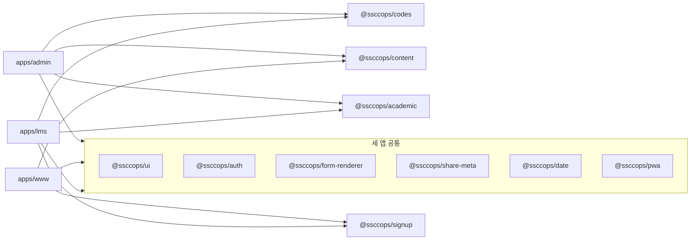

# 웹 구조

ssccops-web은 앱 셋과 공유 패키지를 한 레포에 담은 모노레포입니다. 이 문서는 어떤 앱과 패키지가 있고 새 코드를 어디에 두는지 다룹니다. 웹 코드를 처음 열기 전에 읽습니다.

세부 규칙의 원본은 레포의 [`AGENTS.md`](https://github.com/SoongSilComputingClub/ssccops-web/blob/develop/AGENTS.md)와 [`README.md`](https://github.com/SoongSilComputingClub/ssccops-web/blob/develop/README.md)입니다.

## 한 레포, 여러 앱

레포는 **pnpm workspace와 Turborepo**로 묶여 있습니다.

- [`pnpm-workspace.yaml`](https://github.com/SoongSilComputingClub/ssccops-web/blob/develop/pnpm-workspace.yaml)이 `apps/*`와 `packages/*`를 워크스페이스로 잡습니다. `apps/*`는 배포 단위가 되는 앱이고, `packages/*`는 앱들이 함께 쓰는 공유 패키지입니다.
- [`turbo.json`](https://github.com/SoongSilComputingClub/ssccops-web/blob/develop/turbo.json)이 `dev`, `build`, `lint`, `typegen`, `typecheck` 태스크를 정의합니다. 루트에서 `pnpm dev`를 실행하면 세 앱이 함께 뜹니다.
- 앱 하나만 띄우려면 `pnpm --filter @ssccops/www dev`처럼 패키지 이름으로 거릅니다.

```
ssccops-web/
├── apps/
│   ├── admin/      # @ssccops/admin
│   ├── www/        # @ssccops/www
│   └── lms/        # @ssccops/lms
├── packages/       # @ssccops/* 공유 패키지 10개
├── pnpm-workspace.yaml
└── turbo.json
```

세 앱 모두 같은 백엔드인 [ssccops-server](https://github.com/SoongSilComputingClub/ssccops-server)를 부르고, 로그인은 Supabase Auth(Google OAuth)로 합니다.

## 앱 셋

| 앱 | 하는 일 | 로그인 | 로컬 개발 포트 |
|---|---|---|---|
| `apps/admin` | 운영진용 어드민. 회원, 업무, 회의, 승인함, 폼, 행사, 학술, 공유 링크, OAuth 동의 화면 | 필수. 로그인하지 않으면 로그인 화면으로 보냅니다 | 3000 |
| `apps/www` | 공개 웹사이트. 행사, 콘텐츠, 신청, 내 활동(`/me`), 공개 폼(`/f`), 공유 링크 착지(`/s`) | 대부분 익명으로 엽니다. 신청, 공개 폼, 내 활동, 알림만 로그인이 필요합니다 | 3001 |
| `apps/lms` | 학술 앱. 스터디장 스튜디오, 기획안, 내 신청 | 필수. 다만 로그인 화면으로 보내지 않고 지금 보는 화면 위에서 로그인을 시작합니다 | 3002 |

포트는 각 앱 `package.json`의 `dev` 스크립트와 README 표에서 확인했습니다.

### 로그인 처리가 앱마다 다릅니다

세 앱 모두 `src/middleware.ts`에서 `@ssccops/auth`의 `updateSession`을 부릅니다. 같은 함수지만 넘기는 값과 매처가 다릅니다.

- admin만 가드를 줍니다. `updateSession(request, ADMIN_SESSION_GUARD)`처럼 두 번째 인자로 `SessionGuard`를 넘겨, 로그인하지 않은 요청을 로그인 화면으로 보냅니다. 서버 호출에서 401과 403 `SIGNUP_REQUIRED`가 오면 admin의 `apiFetch`가 로그인 화면이나 가입 화면으로 이동까지 끝냅니다.
- www와 lms는 세션 쿠키만 갱신합니다. 두 번째 인자를 비워 두므로 리다이렉트가 없습니다. 401과 403은 오류로 올라오고 화면이 안내 문구로 그립니다. 미가입이면 같은 자리에서 가입 폼을 엽니다.
- 매처도 반대입니다. www는 토큰이 필요한 경로(`/me`, `/notifications`, 행사 신청, 공개 폼)만 잡고, admin과 lms는 정적 자산과 OAuth 콜백 같은 몇 경로만 빼고 전부 잡습니다.
  www의 본체(행사 목록과 상세)는 익명 공개라, 거기에 세션 확인을 붙이면 로그인하지 않는 방문자 요청마다 Supabase 왕복이 붙기 때문입니다.

자세한 비교표는 레포 `AGENTS.md`의 «인증» 절에 있습니다. 서버 호출 쪽 이야기는 [서버 API 부르기](./talking-to-server.md)에서 다룹니다.

각 앱의 화면, 라우트 그룹, 주요 결정은 앱마다 있는 `AGENTS.md`가 원본입니다.

- [`apps/admin/AGENTS.md`](https://github.com/SoongSilComputingClub/ssccops-web/blob/develop/apps/admin/AGENTS.md)
- [`apps/www/AGENTS.md`](https://github.com/SoongSilComputingClub/ssccops-web/blob/develop/apps/www/AGENTS.md)
- [`apps/lms/AGENTS.md`](https://github.com/SoongSilComputingClub/ssccops-web/blob/develop/apps/lms/AGENTS.md)

## 공유 패키지

`packages/` 아래에는 패키지가 10개 있습니다. 모두 `@ssccops/` 이름으로 앱에서 가져다 씁니다. 어느 앱이 어느 패키지를 쓰는지는 각 앱 `src`에서 실제로 import하는 곳을 찾아 정리했습니다.



표의 «쓰는 앱» 열이 위 그림과 같은 내용입니다.

| 패키지 | 무엇 | 쓰는 앱 |
|---|---|---|
| `@ssccops/ui` | 공용 표시 요소(`Badge`, `Card`, `Markdown`, `Toggle` 등), 테마, 배포 표식, `BrandMark`, 계정 메뉴 | admin, www, lms |
| `@ssccops/auth` | Supabase 클라이언트, 세션 갱신(`updateSession`), `?next=` 검증, OAuth 목적지 쿠키, 요청 오리진 계산(`requestOrigin`) | admin, www, lms |
| `@ssccops/form-renderer` | 폼 문항 렌더링과 응답 검증. 서버 호출 방식은 모릅니다 | admin, www, lms |
| `@ssccops/share-meta` | 공유 카드 문구와 공유 대상별 착지 앱 규칙(결정 기록 ADR-0017) | admin, www, lms |
| `@ssccops/date` | 서버 일시 문자열을 화면 표기로 바꾸는 규칙과 서울 기준 오늘(`todayInSeoul`) | admin, www, lms |
| `@ssccops/pwa` | 서비스워커, 푸시 구독, 설치, 오프라인, 알림 목록 UI(결정 기록 ADR-0045) | admin, www, lms |
| `@ssccops/codes` | 서버 표준코드와 표시명. 표시명은 서버 시드 데이터와 글자까지 맞춘 계약입니다 | admin, lms |
| `@ssccops/content` | 콘텐츠 페이지 카탈로그. www의 라우트 표와 어드민의 페이지 목록이 같은 표를 씁니다 | admin, www |
| `@ssccops/signup` | 가입 화면 한 벌(`SignupStep`, `MemberLinkStep`). 서버 호출 함수는 앱이 넘겨 줍니다 | www, lms |
| `@ssccops/academic` | 두 앱이 같은 값을 써야 하는 학술 판정 기준. 지금은 «낮은 출석률» 경계(70%)와 출석률 계산이 있습니다 | admin, lms |

패키지마다 `AGENTS.md`가 원본입니다(`pwa`는 `README.md`, `academic`은 [`src/index.ts`](https://github.com/SoongSilComputingClub/ssccops-web/blob/develop/packages/academic/src/index.ts) 머리 주석). 레포 루트 `README.md`와 `AGENTS.md`의 패키지 표는 이 목록보다 짧을 수 있으니, 목록이 궁금하면 [`packages/`](https://github.com/SoongSilComputingClub/ssccops-web/tree/develop/packages) 폴더를 직접 보는 것이 정확합니다.

## 무엇을 어디에 두나: «둘 이상» 규칙

**앱끼리는 소스를 공유하지 않습니다.** 각 앱은 자기 `src` 안에 FSD 계층을 따로 가집니다. admin의 코드를 www에서 상대 경로로 가져오는 일은 없습니다.

두 앱 이상이 실제로 같은 것을 쓰게 되면 **`packages/`로 올립니다.** 사본을 두면 한쪽만 고쳤을 때 갈라진 것을 타입 검사도 린트도 잡지 못하기 때문입니다.

실제 사례가 `@ssccops/academic`입니다. admin과 lms의 `entities/academic-session/model/attendance-rate.ts`가 주석을 빼면 글자까지 같았습니다. 출석 기준이 바뀌는 날 한쪽만 고치면 두 화면이 서로 다른 사람을 «낮은 출석률»로 가리키게 됩니다. 그래서 패키지로 올렸습니다(ssccops-web#698).

반대로 한 앱만 쓰는 것은 그 앱에 둡니다. 전부 올리면 패키지가 세 앱의 합집합이 되어 아무도 손대지 못하게 됩니다. 이름만 같고 쓰임이 다른 것도 올리지 않습니다.

예를 들어 `Chip`은 admin에서는 필터 칩, www와 lms에서는 선택 칩이라 각 앱에 남아 있습니다. 무엇이 올라갔고 무엇이 왜 남았는지는 [`packages/ui/AGENTS.md`](https://github.com/SoongSilComputingClub/ssccops-web/blob/develop/packages/ui/AGENTS.md)에 표로 있습니다.

:::warning[새 패키지를 만들면 `@source`를 더합니다]

Tailwind v4는 선언된 경로만 훑어 클래스를 만들고, 없는 클래스는 조용히 건너뜁니다. 마크업이 있는 공유 패키지를 새로 만들면 세 앱의 `globals.css`에 그 패키지를 가리키는 `@source` 줄을 더해야 합니다. 빠뜨려도 타입 검사, 린트, 빌드가 모두 통과하고 화면만 깨집니다. 확인은 앱이 작은 www나 lms에서 합니다.

:::

## 기술 스택

세 앱의 `package.json`에서 확인한 버전입니다.

| 항목 | 버전 |
|---|---|
| Next.js (App Router) | 16.3.0 |
| React, React DOM | 19.2.8 |
| TypeScript | ^5 |
| Tailwind CSS | ^4 |
| ESLint | ^9 (`eslint-config-next` 16.3.0) |
| Supabase | `@supabase/ssr` ^0.12.4, `@supabase/supabase-js` ^2.112.3 |
| pnpm | 10.29.3 (루트 `packageManager`) |
| Turborepo | ^2.5.8 |

- 상태 관리 라이브러리 `zustand`는 admin만 의존합니다.
- 앱과 패키지의 `package.json` 어디에도 shadcn이나 Radix UI 의존성은 없습니다. 공용 표시 요소는 `@ssccops/ui`에 직접 만들어 둡니다.
- Prettier는 쓰지 않습니다. 의존성도 설정 파일도 없습니다.
- 테스트 러너는 아직 없습니다.

Next.js 16은 이전 버전과 API와 규칙이 달라진 곳이 많습니다. 레포 `AGENTS.md` 맨 위에 그 안내가 자동으로 붙어 있으니, 익숙한 방식으로 짜기 전에 설치된 Next.js 문서를 먼저 확인합니다.

## 검증 순서

PR을 올리기 전에 CI와 같은 순서로 돌립니다. 원본은 레포 `AGENTS.md`의 «검증» 절입니다.

```bash
pnpm install --frozen-lockfile
pnpm exec next typegen
pnpm exec tsc --noEmit
pnpm lint
pnpm build
```

`next typegen`을 빼먹으면 새로 받은 트리에서 `PageProps` 같은 전역 타입을 찾지 못해 `tsc`가 실패합니다. 또 ESLint는 타입 검사를 하지 않으므로 `pnpm lint`만 돌리면 타입 오류를 CI에서 처음 만나게 됩니다.

## 다음 읽을 것

- [FSD와 슬라이스](./fsd.md): 앱 안의 폴더 구조와 의존 방향
- [서버 API 부르기](./talking-to-server.md): `apiFetch`, 오류 처리, 새 도메인 붙이기
