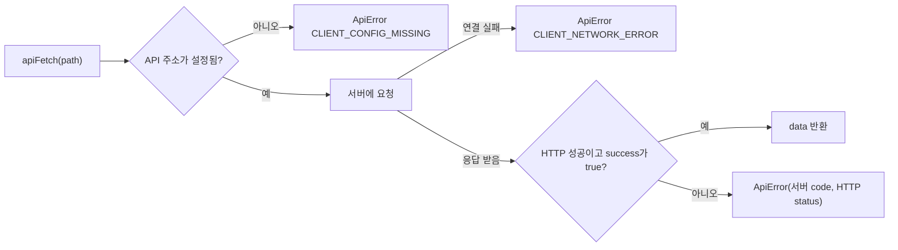

# 서버 API 부르기

웹 앱이 ssccops-server를 부르는 방법을 다룹니다. 요청을 보내는 래퍼, 오류를 가르는 기준, 응답 타입을 쓰는 자리, 새 도메인을 붙이는 순서가 내용입니다. 화면에 서버 데이터를 붙이기 전에 읽습니다.

규칙의 원본은 레포 [`AGENTS.md`](https://github.com/SoongSilComputingClub/ssccops-web/blob/develop/AGENTS.md)의 «서버 연동 규약», «데이터 표기», «인증» 절입니다. 서버 쪽에서 본 같은 약속은 [API 약속](../server/api-contract.md)에 있습니다.

## 직접 만든 래퍼: `apiFetch`와 `apiFetchList`

서버 호출은 `fetch`를 화면에서 바로 부르지 않고, 앱마다 있는 래퍼를 거칩니다. OpenAPI 코드 생성 같은 도구는 쓰지 않고 손으로 만든 함수입니다.

| 앱 | 파일 | 주요 함수 |
|---|---|---|
| admin | [`src/shared/lib/api/client.ts`](https://github.com/SoongSilComputingClub/ssccops-web/blob/develop/apps/admin/src/shared/lib/api/client.ts) | `apiFetch`, `apiFetchList`, `apiUpload`, `ApiError`, `API_ERROR` |
| www | [`src/shared/api/client.ts`](https://github.com/SoongSilComputingClub/ssccops-web/blob/develop/apps/www/src/shared/api/client.ts) | `apiFetch`, `apiFetchNullable`, `apiFetchList`, `ApiError` |
| lms | [`src/shared/api/client.ts`](https://github.com/SoongSilComputingClub/ssccops-web/blob/develop/apps/lms/src/shared/api/client.ts) | `apiFetch`, `apiFetchNullable`, `apiFetchList`, `ApiError` |

admin만 파일 위치가 `shared/lib/api/`이고, www와 lms는 `shared/api/`입니다. 앱끼리 소스를 공유하지 않는 규칙 때문에 세 벌이 따로 있습니다([웹 구조](./structure.md#무엇을-어디에-두나-둘-이상-규칙)).

### 봉투를 벗겨 `data`만 돌려줍니다

서버의 모든 응답은 같은 모양의 봉투에 담겨 옵니다.

```ts
{ success: boolean, code: string, message: string, data: T | null, page?: PageEnvelope }
```

`apiFetch`는 이 봉투를 열어 `data`만 돌려줍니다. 호출하는 쪽은 `success`나 HTTP 상태를 다시 볼 필요가 없습니다.

### 실패는 모두 `ApiError`입니다

요청이 실패하면 어떤 경우든 `ApiError`가 던져집니다. `ApiError`에는 서버가 준 `code`와 HTTP `status`가 실려 있습니다.

```ts
export class ApiError extends Error {
  readonly code: string;
  readonly status: number;
}
```

서버에 닿지도 못한 실패도 같은 모양으로 옵니다. 래퍼가 클라이언트 쪽 코드를 붙여 줍니다.

- `CLIENT_CONFIG_MISSING`: `NEXT_PUBLIC_API_BASE_URL`이 비어 있어 요청을 보내지 않았습니다.
- `CLIENT_NETWORK_ERROR`: 서버에 연결하지 못했습니다. 서버가 꺼졌을 때와 CORS에 등록되지 않았을 때 증상이 같습니다.

`apiFetch` 한 번이 끝나는 길은 다음 셋 중 하나입니다.



### 분기는 `message`가 아니라 `code`로 합니다

**호출부는 `error.code`로 분기합니다.** `message`는 서버에서 문구를 다듬으면 바뀌지만 `code`는 계약이라 바뀌지 않습니다. HTTP 상태로만 가르는 것도 피합니다. 같은 403에 «권한 없음»(`FORBIDDEN`)과 «미가입»(`SIGNUP_REQUIRED`)이 함께 오기 때문입니다.

화면에 띄울 문구는 `features/<slice>/model/*-error.ts`가 `code`를 보고 정합니다. admin의 [`features/work/model/work-error.ts`](https://github.com/SoongSilComputingClub/ssccops-web/blob/develop/apps/admin/src/features/work/model/work-error.ts)가 한 예입니다. 화면은 이 함수만 부르고, 모르는 코드가 오면 서버 메시지를 그대로 보여 줍니다.

```ts
switch (error.code) {
  case API_ERROR.FORBIDDEN:
  case API_ERROR.ACCESS_DENIED:
    return "업무를 볼 권한이 없습니다 — 업무 관리(WORK_MANAGE) 권한이 필요합니다";
  // ...
}
```

### 401과 403은 앱마다 다르게 처리합니다

- **admin**: `apiFetch`가 401이면 토큰을 한 번 갱신해 다시 보내고, 그래도 401이면 로그아웃한 뒤 로그인 화면으로 보냅니다. 403 `SIGNUP_REQUIRED`면 가입 화면으로 보냅니다. 호출부에는 오류만 올라옵니다.
- **www, lms**: 리다이렉트하지 않습니다. 401과 403은 오류로 올라오고 화면이 안내로 그립니다. 미가입이면 같은 자리에서 가입 폼을 엽니다.
- 남은 403(권한 부족)은 어느 앱이든 화면이 문구로 안내합니다.

www와 lms에는 로그인이 필요한 호출용 함수가 따로 있습니다. 서버 컴포넌트에서는 `shared/api/authed-client.ts`의 `apiFetchAuthed`, 브라우저에서는 `shared/api/browser-client.ts`의 `apiFetchAuthedFromBrowser`를 씁니다. 둘 다 토큰을 헤더에 싣는 일만 더하고, 봉투를 벗기는 일과 `ApiError` 변환은 같은 `apiFetch`를 그대로 지나갑니다.

## 목록은 커서 페이징과 «더 보기»

목록 응답에는 `data` 옆에 `page` 봉투가 함께 옵니다. `apiFetch`는 `data`만 돌려주므로 `page`가 버려집니다. 그래서 커서 페이징 목록은 **`apiFetchList`를 씁니다.** 이 함수는 `{ data, page }`를 함께 돌려줍니다.

```ts
const { data, page } = await apiFetchList<WorkListItemResponse>("/v1/works?...");
```

`page`에는 `nextCursor`, `hasNext`, `totalCount` 등이 들어 있습니다. 페이지 번호는 없습니다. 다음 페이지는 받은 `nextCursor`를 `cursor` 파라미터로 되돌려 보내서 받고, `hasNext`가 `false`면 끝입니다.

화면은 페이지 번호 목록을 그리지 않고 «더 보기» 버튼을 둡니다. admin의 `features/work/model/use-work-list.ts`가 `loadMore`로 다음 페이지를 이어 붙이는 예입니다. 필터 조건이 바뀌면 커서를 버리고 처음부터 다시 받습니다. 다른 조건의 페이지가 한 목록에 섞이지 않게 하려는 것입니다.

## 응답 타입과 `to*` 변환은 `entities/<slice>/api`에 손으로 씁니다

서버 응답 타입은 코드 생성 없이 `entities/<slice>/api/*.ts`에 직접 씁니다. 같은 파일에 응답을 화면용 도메인 타입으로 옮기는 `to*` 함수를 둡니다. **서버 응답의 모양을 아는 곳은 이 파일 하나로 제한합니다.** 계약이 바뀌면 고칠 곳이 `to*` 하나로 끝나기 때문입니다.

admin의 [`entities/curriculum-item/api/curriculum-items.ts`](https://github.com/SoongSilComputingClub/ssccops-web/blob/develop/apps/admin/src/entities/curriculum-item/api/curriculum-items.ts)가 짧은 예입니다.

```ts
interface CurriculumItemWithSessionResponse {
  curriculumItemId: number;
  ttl: string | null;
  actlYmd: string | null;
  // ...
}

function toCurriculumItem(res: CurriculumItemWithSessionResponse): CurriculumItemWithSession {
  return {
    curriculumItemId: res.curriculumItemId,
    title: res.ttl ?? "",
    actualYmd: res.actlYmd,
    // ...
  };
}

export async function fetchCurriculumItems(academicProgramId: number) {
  const items = await apiFetch<CurriculumItemWithSessionResponse[] | null>(
    `/v1/academic-programs/${academicProgramId}/curriculum-items`,
  );
  return (items ?? []).map(toCurriculumItem);
}
```

:::warning[변환에서 없는 값을 만들지 않습니다]

빈 이름을 `"-"`로 채우는 것은 표시 규칙이고, 그것은 그리는 쪽(`views`)이 정합니다. 변환 함수가 채워 버리면 «값이 없다»와 «서버가 `-`를 줬다»를 구별할 수 없습니다.

:::

## 데이터 표기

웹의 이름은 서버 데이터 사전을 따릅니다. 원본은 레포 `AGENTS.md`의 «데이터 표기» 절입니다.

| 항목 | 규칙 | 예 |
|---|---|---|
| 필드 | DB 컬럼 ID의 lowerCamelCase | `mbr_id` → `mbrId` |
| 타입 이름 | 테이블 ID의 PascalCase | `sub_work_aprv` → `SubWorkAprv` |
| 식별자 | `number` 단일 키. URL에도 숫자 | `/members/1` |
| 불리언 | `*Yn` 접미사 | `sysYn`, `useYn` |
| 날짜와 일시 | 날짜는 `YYYY-MM-DD`, 일시는 ISO-8601 | |
| 코드값 | 코드로 비교합니다. 한글 표시 문자열로 비교하지 않습니다 | |

코드값은 `@ssccops/codes`와 각 앱의 `shared/config/codes.ts`에서 가져옵니다. 화면에 보이는 한글 이름(«진행 중» 같은 것)으로 `if`를 쓰면, 표시명이 바뀌는 날 조건이 조용히 틀어집니다. 표시명 자체도 서버 시드 데이터와 글자까지 맞춘 계약이라 화면에서 다듬지 않습니다.

D-day, 마감 임박, 진행률 같은 값은 저장하지 않고 화면에서 계산합니다. 기준일은 `@ssccops/date`의 `todayInSeoul()`입니다.

## 새 도메인을 붙이는 순서

서버에 새 도메인 API가 생겨 화면에 붙일 때는 다음 다섯 단계를 따릅니다. 폼 도메인이 처음 밟은 순서입니다.

1. **`entities/<slice>/api/*.ts`**: `apiFetch`나 `apiFetchList` 호출, 서버 응답 타입(`*Response`), 도메인 타입으로 옮기는 `to*` 함수를 씁니다.
2. **`entities/<slice>/model/types.ts`**: 화면이 쓰는 도메인 타입을 둡니다.
3. **`features/<slice>/model/use-*.ts`**: 로딩, 오류, 재조회 상태를 쥐는 훅을 만듭니다.
4. **`features/<slice>/model/*-error.ts`**: `ApiError.code`를 화면 문구로 바꾸는 함수를 만듭니다. 화면은 이 함수만 부릅니다.
5. **목업을 지웁니다.** 서버 없이 만들던 시기의 mock JSON이나 임시 zustand 스토어가 남아 있으면 제거합니다.

그다음 `views/<slice>/ui`에서 화면을 조립하고 `app/` 라우트에서 감쌉니다. 계층 이야기는 [FSD와 슬라이스](./fsd.md)에 있습니다.

## 인증

로그인은 Supabase Auth와 Google OAuth입니다. 세 앱의 로그인 버튼이 Supabase의 `signInWithOAuth`를 `provider: "google"`로 부르고, 돌아오는 OAuth 콜백은 각 앱의 `app/auth/callback/` 라우트가 받습니다.

서버를 부를 때는 Supabase 세션의 access token을 `Authorization: Bearer` 헤더에 실어 보냅니다. 토큰이 유효한지는 ssccops-server가 판단합니다.

세션 쿠키 갱신은 공유 패키지 [`@ssccops/auth`](https://github.com/SoongSilComputingClub/ssccops-web/blob/develop/packages/auth/AGENTS.md)의 `updateSession` 한 벌이 맡고, 각 앱의 `src/middleware.ts`가 부릅니다.

- `updateSession`은 기본이 갱신기입니다. 미인증 요청을 로그인 화면으로 보내는 것은 두 번째 인자로 `SessionGuard`를 줄 때뿐이고, 주는 앱은 admin 하나입니다.
- 미들웨어 매처는 좁게 잡습니다. `updateSession`이 요청마다 Supabase를 한 번 왕복하기 때문입니다. 앱별 매처 차이는 [웹 구조](./structure.md#로그인-처리가-앱마다-다릅니다)에 있습니다.
- Next.js 16에서는 `middleware.ts` 대신 `proxy.ts`가 새 규칙이지만, 바꾸지 않습니다. 배포 어댑터 `@opennextjs/cloudflare`가 아직 `proxy.ts`를 인식하지 못해 빌드가 깨집니다. admin이 한 번 옮겼다가 되돌린 적이 있습니다.
- 라우트 핸들러에서 자기 주소가 필요하면 `new URL(request.url).origin` 대신 `@ssccops/auth`의 `requestOrigin(request)`를 씁니다. 컨테이너에서 실행하면 `request.url`의 오리진이 공개 도메인이 아니라 서버가 듣는 주소가 되기 때문입니다.

권한 판정(역할, 권한 코드, `useCan`)은 admin에만 있고 원본은 [`apps/admin/AGENTS.md`](https://github.com/SoongSilComputingClub/ssccops-web/blob/develop/apps/admin/AGENTS.md)입니다.

## 다음 읽을 것

- [API 약속](../server/api-contract.md): 같은 약속을 서버 쪽에서 본 문서
- [FSD와 슬라이스](./fsd.md): `entities`와 `features`를 나누는 기준
