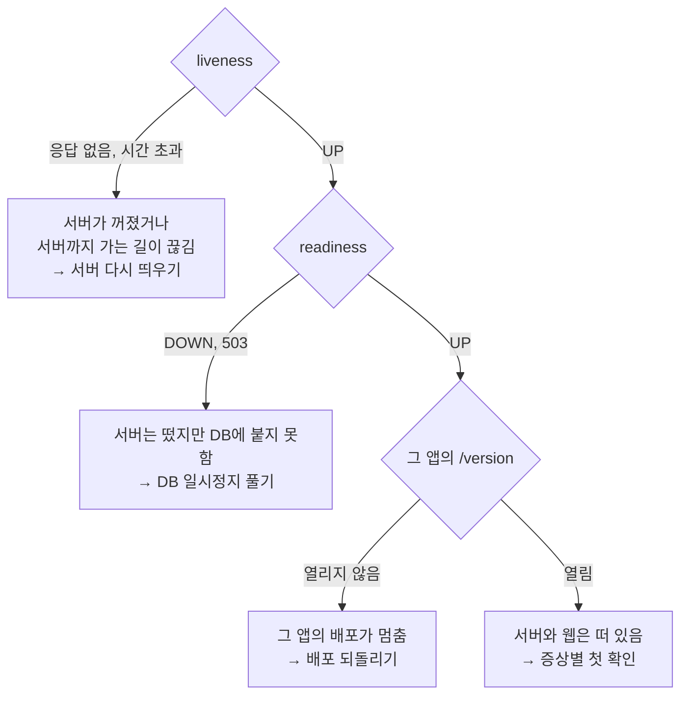

# 어디가 멈췄는지 가르기

SSCCOps는 웹 앱 셋(공개 웹, 어드민, LMS)이 API 서버 하나를 부르고, 서버가 DB에 붙는 구조입니다. 어느 층이 멈췄는지에 따라 할 일과 넘길 사람이 달라지니, 아래 주소를 위에서부터 엽니다. 모두 로그인 없이 브라우저로 열 수 있습니다.

## 확인 주소

| 무엇 | 주소 | 정상일 때 |
|---|---|---|
| 서버가 살아 있나 | https://api.sscc-ssu.com/actuator/health/liveness | `{"status":"UP"}` |
| 서버가 요청을 받을 수 있나 (DB 연결 포함) | https://api.sscc-ssu.com/actuator/health/readiness | `{"status":"UP"}` |
| 서버에 떠 있는 버전 | https://api.sscc-ssu.com/actuator/info | `build.version`에 버전, `git.commit.id`에 커밋 |
| 공개 웹 | https://www.sscc-ssu.com/version | `version`, `sha`, `builtAt` |
| 어드민 | https://admin.sscc-ssu.com/version | 위와 같음 |
| LMS | https://lms.sscc-ssu.com/version | 위와 같음 |

`/actuator/health`처럼 뒤에 아무것도 붙지 않은 주소는 로그인이 필요해 401이 나옵니다. 장애가 아닙니다.

## 결과 읽기

- liveness가 응답하지 않으면 웹 세 앱 모두 «서버에 연결할 수 없습니다»(`CLIENT_NETWORK_ERROR`)로 보입니다. [서버 다시 띄우기](recovery/restart-api.md)
- readiness가 DOWN이면 서버를 다시 켜도 같은 상태로 돌아옵니다. 원인이 DB에 있기 때문입니다. [DB 일시정지 풀기](recovery/resume-db.md)
- 운영 웹 한 앱의 `/version`만 열리지 않으면 그 앱의 Vercel 프로젝트를 봅니다. [배포 되돌리기](recovery/rollback.md#운영-웹-되돌리기)
- 모두 열리면 서버와 웹은 떠 있습니다. 특정 기능, 권한, 화면의 문제이니 [증상별 첫 확인](symptoms.md)으로 갑니다.

## 버전 맞추기

서버와 웹은 따로 배포되지만 릴리즈마다 같은 버전으로 함께 올립니다. 서버의 `build.version`과 세 앱의 `version`이 같은지 봅니다. 다르면 나중에 생긴 응답 값이 화면에서 오류 없이 빈 채로 보일 수 있습니다.

방금 배포했는데 화면이 그대로라면 서버의 `git.commit.id`와 웹의 `sha`가 배포한 커밋과 같은지 봅니다. GitHub Actions가 초록이어도 새 버전이 실제로 떴다는 뜻은 아닙니다. 떠 있는지는 이 응답으로만 확인합니다.
