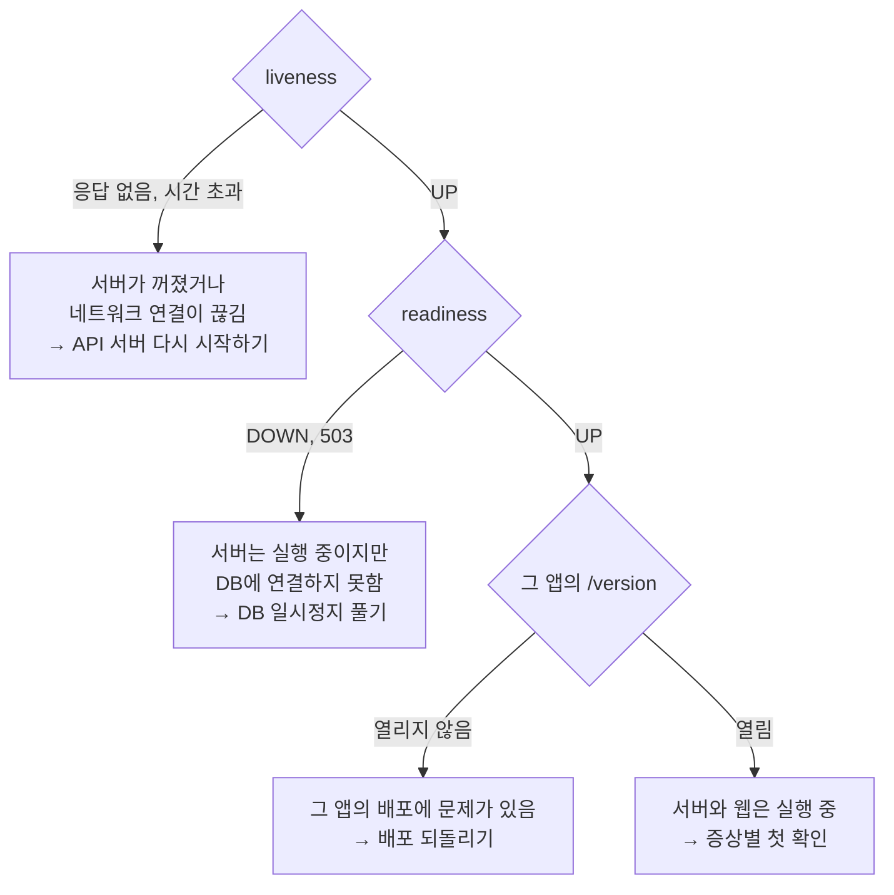

# 장애가 발생한 곳 확인하기

세 웹 앱(공개 웹, 어드민, LMS)은 하나의 API 서버에 요청을 보내고, API 서버는 DB에 연결합니다. 웹, API 서버, DB 중 어디에 문제가 있는지에 따라 조치 방법과 담당자가 달라지므로 아래 주소를 위에서부터 차례로 엽니다. 모두 로그인 없이 브라우저로 열 수 있습니다.

## 확인 주소

| 확인할 것 | 주소 | 정상일 때 |
|---|---|---|
| API 서버가 실행 중인지 | https://api.sscc-ssu.com/actuator/health/liveness | `{"status":"UP"}` |
| API 서버가 요청을 처리할 수 있는지 (DB 연결 포함) | https://api.sscc-ssu.com/actuator/health/readiness | `{"status":"UP"}` |
| 실행 중인 서버 버전 | https://api.sscc-ssu.com/actuator/info | `build.version`에 버전, `git.commit.id`에 커밋 |
| 공개 웹 | https://www.sscc-ssu.com/version | `version`, `sha`, `builtAt` |
| 어드민 | https://admin.sscc-ssu.com/version | 위와 같음 |
| LMS | https://lms.sscc-ssu.com/version | 위와 같음 |

`/actuator/health`처럼 뒤에 아무것도 붙지 않은 주소는 로그인이 필요해 401이 나옵니다. 장애가 아닙니다.

## 결과 해석

- liveness가 응답하지 않으면 세 웹 앱 모두 «서버에 연결할 수 없습니다»(`CLIENT_NETWORK_ERROR`)로 표시됩니다. [API 서버 다시 시작하기](recovery/restart-api.md)
- readiness가 DOWN이면 원인이 DB에 있으므로 서버를 다시 시작해도 해결되지 않습니다. [DB 일시정지 풀기](recovery/resume-db.md)
- 운영 웹 한 앱의 `/version`만 열리지 않으면 그 앱의 Vercel 프로젝트를 확인합니다. [배포 되돌리기](recovery/rollback.md#운영-웹-되돌리기)
- 모두 열리면 서버와 웹은 실행 중입니다. 특정 기능, 권한, 화면의 문제이므로 [증상별 첫 확인](symptoms.md)으로 갑니다.

## 버전 맞추기

서버와 웹은 따로 배포되지만 릴리즈마다 같은 버전으로 함께 올립니다. 서버의 `build.version`과 세 앱의 `version`이 같은지 확인합니다. 버전이 다르면 나중에 추가된 응답 값이 화면에서 오류 없이 빈칸으로 보일 수 있습니다.

방금 배포했는데 화면이 그대로라면 서버의 `git.commit.id`와 웹의 `sha`가 배포한 커밋과 같은지 확인합니다. GitHub Actions가 성공으로 표시돼도 새 버전이 실제로 실행 중이라는 뜻은 아닙니다. 실행 중인 버전은 이 응답으로 확인합니다.
